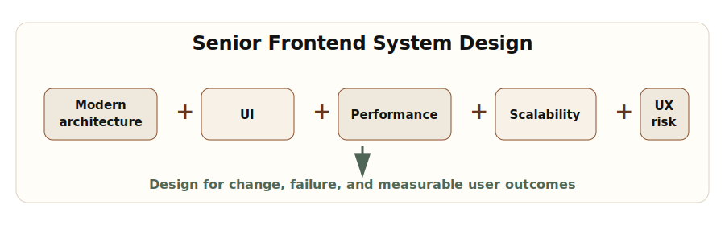
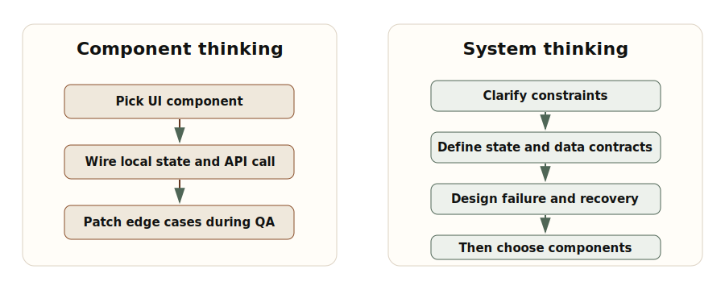
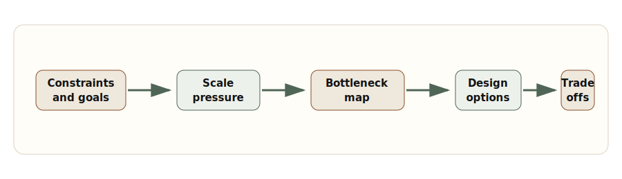

# Chapter 1: Beyond the Component

**Chapter objective:** Establish the mental model shift from component thinking to system thinking — the foundational skill that distinguishes senior frontend engineers from mid-level implementers.

**Why this matters:** At senior levels, implementation quality is table stakes. The evaluation expands to judgment: the ability to turn vague product intent into technical constraints, identify irreversible decisions, and protect the experience under scale, failure, and change.

---

Senior frontend system design starts when the question stops being, "Which component should I build?" and becomes, "What user experience, data flow, failure behavior, and operating model must this system preserve as it grows?"

That shift is uncomfortable because frontend engineers are trained to make visible things. Components, routes, animations, forms, and API calls are tangible. System design is less immediately visible. It lives in decisions about ownership, constraints, state boundaries, rendering strategy, recovery behavior, accessibility, performance, security, and observability.

For a senior frontend engineer, those decisions are the work. The component is one expression of the design, not the design itself.

> *Components are implementation units. Senior frontend system design is the discipline of making user-facing software behave correctly under scale, ambiguity, failure, and change.*

## Why This Matters for Senior Frontend Roles

At junior and mid levels, a frontend engineer is often evaluated by implementation quality: can they build the screen, manage state, handle edge cases, write tests, and follow the design system? At senior levels, that is table stakes. The evaluation expands to judgment.

Can they turn vague product intent into technical constraints? Can they identify the decisions that will become expensive to reverse? Can they explain why a route should be server-rendered, client-rendered, streamed, cached, or split? Can they decide which state belongs in the URL, which belongs in a server cache, which belongs locally, and which should not exist at all? Can they make failure states explicit before production traffic discovers them?

In interviews, this is why strong candidates do not rush into React code. They ask about users, traffic, data freshness, latency, accessibility, security, observability, deployment risk, device constraints, and team ownership. They use code to validate a design, not to avoid one.

In production teams, the same skill shows up as leverage. A senior frontend engineer prevents five teams from solving the same error handling problem differently. They make performance budgets visible. They choose integration contracts that reduce product coupling. They make design system adoption easier than local invention. They name risks early enough that leaders can act on them.

## Problem Framing and Constraints

A frontend system is not just a collection of screens. It is a set of contracts between the user, browser, application shell, network, backend services, design system, content model, telemetry pipeline, and release process.

Before designing, write down the constraints. Constraints are not bureaucracy. They are the shape of the problem.

For a dashboard, constraints might include:

- Data freshness must be less than 10 seconds for active incidents.
- The first useful content must appear under the agreed performance budget on mid-tier mobile devices.
- Users must be able to recover when a partial API failure occurs.
- Keyboard users must be able to navigate tables, filters, dialogs, and notifications without hidden traps.
- Permission rules must be enforced by the backend and represented clearly in the UI.
- Telemetry must classify network errors, rendering errors, stale data, and user-abandoned flows.

Notice what is missing: no component names yet. That is intentional. Component design comes after we understand the behavior the system must protect.

## Architecture Model



_System Design Equation — Senior frontend design combines architecture, UI, performance, scalability, and user experience into one operating model._

A practical mental model separates the design into five layers.

**Layer 1 — Product behavior.** What must the user be able to do, and what feedback must they receive during loading, success, failure, delay, empty states, and permission boundaries?

**Layer 2 — Data and state.** What data enters the UI? Who owns it? How fresh must it be? What can be cached? What needs optimistic updates? What survives navigation? What belongs in the URL?

**Layer 3 — Rendering and delivery.** Which parts can be statically generated? Which need server rendering? Which require client interactivity? Which can stream progressively?

**Layer 4 — Operational safety.** How do we detect errors, correlate them to releases, recover from partial failures, protect security boundaries, and degrade gracefully?

**Layer 5 — Team scale.** What patterns are shared? What remains local? Where are the paved paths documented? How do teams evolve the system without creating accidental forks?



_Component Thinking Versus System Thinking — Component thinking optimizes the immediate screen. System thinking makes the surrounding contracts explicit before implementation._

## Requirements Before Code

The strongest frontend design conversations start with requirements that are specific enough to create constraints but not so specific that they smuggle in implementation too early.

Ask:

- What is the primary user journey?
- What is the worst acceptable latency?
- What data can be stale, and for how long?
- What happens when one backend dependency fails?
- Which interactions must work without a mouse?
- Which user roles can see, edit, export, approve, or delete?
- Which telemetry events prove the experience is working?
- Which parts of the experience should remain stable during partial deploys?

Once those answers exist, implementation becomes easier. You can decide whether a route should stream summary content before details. You can decide whether filter state belongs in the URL. You can decide whether a mutation should be optimistic. You can decide where an error boundary belongs. You can decide whether an interaction needs a local state machine instead of loosely coupled booleans.



_Requirements-Before-Code Flow — The senior path moves from constraints to scale pressure, bottlenecks, design options, and explicit trade-offs._

## Implementation Notes

Implementation should preserve the design decisions instead of hiding them in scattered code. Three lightweight artifacts help.

**Architecture decision record (ADR)** — useful when a decision will be expensive to reverse or when future teams need to understand context. Use it for rendering strategy, state ownership, real-time transport, cache invalidation, permission boundaries, and shared platform contracts.

```ts
export type ArchitectureDecisionStatus =
  | "proposed"
  | "accepted"
  | "superseded";

export type FrontendArchitectureDecision = {
  id: string;
  title: string;
  status: ArchitectureDecisionStatus;
  owner: string;
  context: string;
  decision: string;
  alternatives: Array<{
    option: string;
    tradeOff: string;
    reasonRejected?: string;
  }>;
  constraints: {
    performanceBudget?: string;
    accessibilityRequirement?: string;
    securityBoundary?: string;
    dataFreshness?: string;
  };
  operationalImpact: {
    telemetry: string[];
    failureModes: string[];
    rollbackPlan: string;
  };
  reviewedAt: string;
};
```

**System design checklist** — keeps design from collapsing into personal preference.

*Product behavior:* Primary user journey is named and testable. Loading, empty, error, and permission states are specified. Success and recovery feedback are visible.

*Data and state:* Server state and client state are separated. URL state is used for shareable filters or navigation context. Cache freshness and invalidation rules are explicit.

*Rendering:* Route rendering strategy is justified by content type and performance target. Critical content is not blocked by noncritical JavaScript.

*Operations:* Error boundaries have clear placement around product boundaries. Telemetry classifies user-impacting failures. Rollback and degraded-mode behavior are documented.

**Requirement clarification template** — use before a production design review or a system design interview:

- *Users:* Who are the intended user types or roles?
- *Core journey:* What is the single most important task this UI must enable reliably?
- *Scale assumptions:* Traffic, data volume, device profile.
- *Latency budget:* First useful content target; interaction response maximum.
- *Data rules:* Freshness, consistency, offline behavior.
- *Risk questions:* What failure modes must be explicitly handled before launch?

## Trade-offs

| Decision | Option A | Option B | Senior trade-off |
| --- | --- | --- | --- |
| Rendering | Server render critical route | Client render after shell load | Server rendering improves first content and SEO, but requires careful data boundaries and cache strategy. Client rendering can simplify personalization but risks blank states and larger JavaScript. |
| State | Keep filter state in URL | Keep filter state locally | URL state improves shareability, back/forward behavior, and recovery. Local state is simpler for ephemeral controls but can make the product feel unstable after refresh. |
| Data fetching | Route-level fetch | Component-level fetch | Route-level fetch clarifies ownership and avoids waterfalls. Component-level fetch can support modularity but can hide latency chains. |
| Error handling | Central error model | Local ad hoc messages | A central model improves consistency and observability. Local messages can be faster to ship but usually drift. |
| Platform pattern | Shared paved path | Team-specific implementation | Shared paths reduce repeated decisions. Team-specific code can be appropriate when the product problem is genuinely unique. |

## Failure Modes

A frontend design is incomplete until it explains how it fails. Common production failure modes include:

- An API succeeds slowly enough that users retry and create duplicate work.
- A route renders but a secondary widget fails and blocks the entire page.
- A mutation succeeds on the server but the client cache is not invalidated.
- A permission change arrives after the UI has already rendered an action.
- A design system component works visually but breaks keyboard navigation in a composite workflow.
- A release introduces a hydration mismatch that only appears for personalized users.
- Telemetry reports an error but cannot identify the journey, user role, route, or release.

Recovery design means classifying these failures. Some should block. Some should degrade. Some should retry. Some should require explicit user action. Treating every failure as a generic toast is not resilience — it is noise.

> **Production failure test**
>
> For every critical page, ask what the user sees when the primary API fails, the secondary API fails, auth expires, JavaScript loads slowly, and the browser restores an old tab.

## Interview Lens

In a senior frontend system design interview, resist the temptation to start with a component tree. Start with a short framing statement:

> I want to clarify the user journey, scale assumptions, freshness requirements, failure behavior, and performance budget before choosing the React structure.

Then walk through the layers in order: user journey and constraints → data ownership and state taxonomy → rendering and routing strategy → interaction model and accessibility → failure handling and recovery → observability and release safety → component boundaries and implementation details.

This order signals seniority because it shows that code is part of a larger system. It makes the answer easier to challenge and extend.

## Key Takeaways

- Senior frontend engineering is evaluated on judgment, not just implementation skill.
- System design starts with constraints, not components.
- A mental model of five layers (product behavior, data/state, rendering, operational safety, team scale) structures the design conversation.
- Requirements before code prevents expensive architectural rework.
- Failure modes should be classified and designed for, not discovered in production.
- Performance, accessibility, security, and observability are architecture concerns, not afterthoughts.

## Production Checklist

- [ ] The primary user journey is named and measurable.
- [ ] Critical states are designed: loading, empty, error, partial failure, permission denied, and success.
- [ ] Route rendering strategy is chosen for a reason, not by default.
- [ ] State ownership is explicit: local, URL, server, global, derived, or workflow.
- [ ] API contracts include error shape, freshness expectations, and retry behavior.
- [ ] Accessibility behavior is built into structure, focus, labels, keyboard flow, and validation.
- [ ] Performance budgets are attached to route and interaction outcomes.
- [ ] Security boundaries do not rely on client-only checks.
- [ ] Telemetry can classify failures by route, user journey, dependency, and release.
- [ ] The architecture decision is documented enough for another team to reuse.

---

[← Preface](00-preface.md) | [Table of Contents](../README.md) | [Chapter 2: Real-Time Frontend Systems →](02-real-time-frontend-systems.md)

*Source: [Senior Frontend System Design: Beyond the Component](https://blog.ranveerkumar.com/articles/senior-frontend-system-design-beyond-the-component)*
