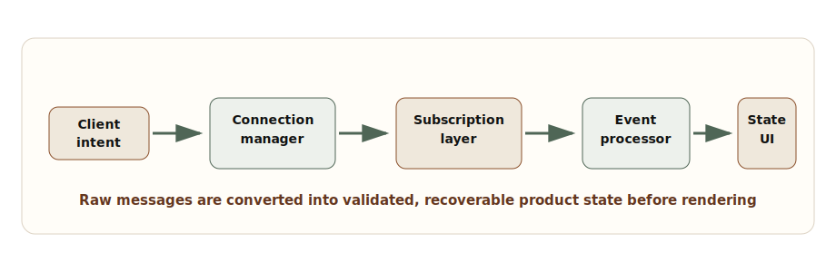
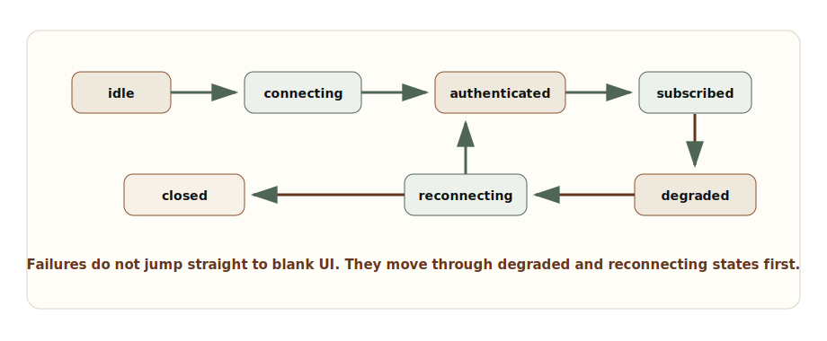
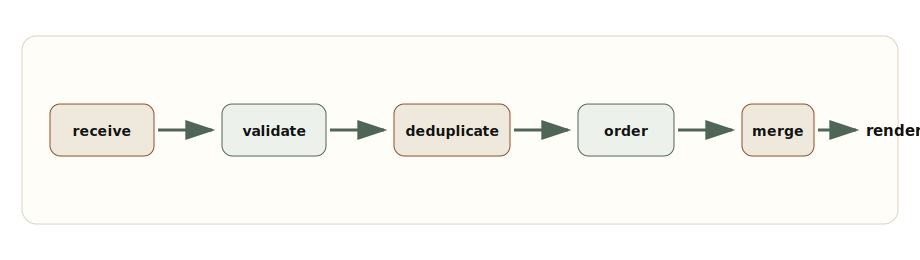

# Chapter 2: Real-Time Frontend Systems

**Chapter objective:** Design resilient real-time frontend architectures that handle transport lifecycle, event ordering, reconnection, optimistic UI, and degraded mode — not just socket connections.

**Why this matters:** Real-time features expose whether a frontend engineer thinks in components or systems. The design for a chat application, trading dashboard, incident console, collaborative editor, or AI streaming interface can look simple in a demo and fail badly in real networks.

---

A WebSocket connection is not a real-time architecture.

That matters because many frontend designs treat the transport as the system. Once the browser can open a socket and receive messages, the architecture is considered done. Then production arrives: the network drops, the tab sleeps, events arrive twice, events arrive out of order, auth expires, the user performs an optimistic action, the server rejects it, and the UI has to keep making sense.

Real-time frontend system design is the discipline of preserving correctness and user trust while time, network conditions, server state, and local intent are all changing.

> *Real-time UI is not about making data arrive quickly. It is about making change understandable, recoverable, and correct enough for the product domain.*

## Why This Matters for Senior Frontend Roles

A mid-level implementation might wire `new WebSocket(url)` inside a hook and update state when messages arrive. A senior implementation asks harder questions.

What is the event contract? Are events ordered? Are they idempotent? Can the client recover missed messages? What happens when the user has multiple tabs open? How does authentication refresh? Which data can be optimistic? How does the UI reveal degraded mode without causing panic? How do we observe message lag, reconnect storms, duplicate events, and stale renders?

Senior frontend engineers are expected to design the client side of that contract. They do not need to own every backend detail, but they must understand enough to shape the contract and defend the user experience.

## Problem Framing and Constraints

Before choosing WebSockets, SSE, or polling, define the product behavior.

- Is communication one-way or bidirectional?
- Does the user need every event, or only the latest state?
- Can events be replayed after reconnect?
- Is ordering global, per entity, or irrelevant?
- What is the acceptable staleness window?
- Does the UI need optimistic updates?
- What should happen when the connection is degraded but cached data exists?
- How are authorization, subscription scope, and tenant boundaries enforced?
- What telemetry proves the stream is healthy?

The correct transport depends on these answers. Polling can be perfectly acceptable for low-frequency updates. SSE can be a better fit than WebSockets for one-way server updates. WebSockets are valuable when the client and server need a long-lived bidirectional channel, but they demand more lifecycle discipline.

## Architecture Model

Do not let UI components talk directly to a raw socket. That creates tight coupling between transport events and rendering concerns. Instead, put explicit layers between the network and the UI.

The **connection manager** owns transport lifecycle: connecting, authenticating, heartbeat, reconnect, close, and degraded mode.

The **subscription layer** maps product surfaces to server topics. Each subscription should have ownership, authorization scope, and cleanup.

The **event processor** validates messages, deduplicates them, orders them when the contract requires it, and routes them to the correct state boundary.

The **state store or server cache** owns merge semantics. The UI should read stable state and render user feedback, not parse raw events.



_Real-Time Frontend Architecture — A resilient real-time UI separates transport lifecycle, subscriptions, event processing, state, and rendering._

## Choosing the Transport

Transport choice should follow communication semantics.

**Polling** — when updates are infrequent, exact immediacy is not required, and operational simplicity matters. Easy to cache, easy to debug, and resilient through ordinary HTTP infrastructure.

**SSE (Server-Sent Events)** — when the server pushes one-way updates and the client does not need to send frequent messages on the same channel. SSE has automatic reconnection behavior, fits HTTP deployments naturally, and works well for status feeds, notifications, progress streams, and AI token streaming.

**WebSockets** — when the product needs bidirectional, low-latency communication: collaborative editing, multiplayer interaction, presence, command acknowledgment, or high-frequency dashboards. The client must own connection state, heartbeat, auth renewal, backoff, subscription replay, and stale event handling.

The senior move is to explain the trade-off, not to treat WebSockets as the mature default.

## Event Contracts

A real-time event should be self-describing enough for the client to validate, route, deduplicate, and merge it.

```ts
export type EventEnvelope<TPayload> = {
  id: string;
  type: string;
  topic: string;
  version: number;
  sequence?: number;
  entityId?: string;
  occurredAt: string;
  replayToken?: string;
  payload: TPayload;
};

export type Subscription = {
  topic: string;
  scope: {
    tenantId: string;
    userId: string;
    role: "viewer" | "operator" | "admin";
  };
  replayFrom?: string;
  onEvent: (event: EventEnvelope<unknown>) => void;
  onDegraded: (reason: string) => void;
};
```

The `id` supports deduplication. The `topic` supports routing. The `version` allows schema migration. The optional `sequence` supports ordering when the backend can provide it. The `replayToken` gives the client a recovery point after reconnect. Without these fields, the client is forced to guess.

## Lifecycle State Machine

The connection should be modeled as a state machine. Loose booleans like `isConnected`, `isLoading`, `hasError`, and `shouldReconnect` drift quickly.



_WebSocket Lifecycle State Machine — Connection lifecycle should account for auth, subscriptions, degraded mode, reconnect, and terminal close._

```ts
type ConnectionState =
  | { status: "idle" }
  | { status: "connecting"; attempt: number }
  | { status: "authenticated"; socket: WebSocket }
  | { status: "subscribed"; socket: WebSocket; replayToken?: string }
  | { status: "degraded"; reason: string; replayToken?: string }
  | { status: "reconnecting"; attempt: number; replayToken?: string }
  | { status: "closed"; reason: string };

export class RealtimeConnection {
  private state: ConnectionState = { status: "idle" };
  private subscriptions = new Map<string, Subscription>();

  constructor(
    private readonly createUrl: () => Promise<string>,
    private readonly scheduleRetry: (attempt: number) => number
  ) {}

  async connect() {
    const attempt =
      this.state.status === "reconnecting" ? this.state.attempt + 1 : 1;

    this.state = { status: "connecting", attempt };
    const socket = new WebSocket(await this.createUrl());

    socket.onopen = () => this.authenticate(socket);
    socket.onmessage = (message) => this.handleMessage(message.data);
    socket.onclose = () => this.reconnect("socket closed");
    socket.onerror = () => this.reconnect("socket error");
  }

  subscribe(subscription: Subscription) {
    this.subscriptions.set(subscription.topic, subscription);
    this.send({ type: "subscribe", topic: subscription.topic, replayFrom: subscription.replayFrom });
  }

  private authenticate(socket: WebSocket) {
    this.state = { status: "authenticated", socket };
    this.send({ type: "authenticate" });
    for (const subscription of this.subscriptions.values()) {
      this.subscribe(subscription);
    }
    this.state = { status: "subscribed", socket };
  }

  private reconnect(reason: string) {
    const replayToken =
      "replayToken" in this.state ? this.state.replayToken : undefined;
    const attempt =
      this.state.status === "reconnecting" ? this.state.attempt + 1 : 1;

    this.state = { status: "degraded", reason, replayToken };
    window.setTimeout(() => {
      this.state = { status: "reconnecting", attempt, replayToken };
      void this.connect();
    }, this.scheduleRetry(attempt));
  }

  private send(message: unknown) {
    if ("socket" in this.state) {
      this.state.socket.send(JSON.stringify(message));
    }
  }

  private handleMessage(raw: string) {
    // Parse, validate, deduplicate, merge, and update replay token here.
  }
}
```

## Event Reconciliation

Receiving an event is not the same as applying it.



_Event Reconciliation Sequence — Events should be validated, deduplicated, ordered, merged, and rendered through stable state boundaries._

Deduplication is the simplest place to prevent many production bugs.

```ts
export function createEventDeduper(maxEntries = 1000) {
  const seen = new Map<string, number>();

  return {
    shouldApply(event: EventEnvelope<unknown>, now = Date.now()) {
      if (seen.has(event.id)) {
        return false;
      }

      seen.set(event.id, now);

      if (seen.size > maxEntries) {
        const oldest = [...seen.entries()].sort((a, b) => a[1] - b[1])[0];
        if (oldest) {
          seen.delete(oldest[0]);
        }
      }

      return true;
    }
  };
}
```

For ordered streams, dedupe is not enough. You need to buffer or reject messages based on sequence. A stock ticker may prefer latest value. A payment ledger must not skip events silently. A collaborative editor needs a stronger protocol than a simple sequence number.

## Retry, Backoff, and Degraded UI

Retries can become an outage multiplier. If every tab reconnects instantly after a gateway restart, the frontend participates in the incident. Use backoff with jitter and expose degraded state to the UI.

```ts
export function exponentialBackoffWithJitter(
  attempt: number,
  options = { baseMs: 500, maxMs: 30_000, jitterRatio: 0.35 }
) {
  const exponential = Math.min(
    options.maxMs,
    options.baseMs * 2 ** Math.max(0, attempt - 1)
  );
  const jitter = exponential * options.jitterRatio * Math.random();

  return Math.round(exponential - jitter);
}
```

The UI should not pretend everything is fine during reconnect. It should show the last updated time, a degraded indicator, and whether user actions are queued, disabled, or still safe. This is especially important for operational systems where stale data can lead to wrong decisions.

## Optimistic UI and Conflict Handling

Optimistic UI is useful when the user action is likely to succeed and the domain can tolerate temporary divergence. It is dangerous when actions are irreversible, regulated, security-sensitive, or dependent on complex server validation.

For real-time systems, optimistic updates must be reconciled with server events. A local pending action should have a client correlation ID. When the server confirms, rejects, or transforms the action, the UI needs to merge that outcome without duplicating the item or hiding the failure.

```ts
type PendingMutation = {
  clientMutationId: string;
  entityId: string;
  optimisticPatch: Record<string, unknown>;
  createdAt: number;
};

export function reconcileServerEvent(
  pending: PendingMutation[],
  event: EventEnvelope<{ clientMutationId?: string; entityId: string }>
) {
  const confirmedMutationId = event.payload.clientMutationId;

  return {
    remainingPending: pending.filter(
      (mutation) => mutation.clientMutationId !== confirmedMutationId
    ),
    shouldRenderAsConfirmation: Boolean(confirmedMutationId),
    affectedEntityId: event.payload.entityId
  };
}
```

## Trade-offs

| Decision | Option A | Option B | Senior trade-off |
| --- | --- | --- | --- |
| Transport | WebSocket | SSE or polling | WebSockets support bidirectional low-latency interaction but require lifecycle ownership. SSE and polling are simpler for one-way or low-frequency updates. |
| Ordering | Strict sequence | Latest state wins | Strict ordering protects ledgers and workflows but needs buffering and replay. Latest-wins is simpler for presence, counters, and dashboards. |
| Reconnect | Immediate retry | Backoff with jitter | Immediate retry feels fast in small tests but can amplify incidents. Backoff protects the system and should be paired with visible degraded UI. |
| State merge | Apply events directly | Normalize and reconcile | Direct updates are quick but fragile. Reconciliation costs more upfront and reduces duplicate, stale, and out-of-order bugs. |
| Optimistic UI | Immediate local update | Wait for server confirmation | Optimism improves perceived speed but needs rollback and conflict handling. Confirmation is safer for sensitive workflows. |

## Failure Modes

Real-time systems fail in patterns:

- Duplicate events are applied twice and inflate counters.
- Events arrive out of order and overwrite newer state with older state.
- The client reconnects without replay and silently misses changes.
- A background tab wakes up with stale auth and floods logs with rejected subscriptions.
- Optimistic UI shows success but the server rejects the mutation.
- Multiple tabs each open their own high-frequency connection and multiply load.
- A degraded stream keeps rendering old data without telling the user.

> **The real-time correctness question**
>
> Ask whether the user needs every event, the latest state, or a verified sequence. The answer changes the entire frontend architecture.

## Interview Lens

A strong interview answer starts like this:

> I would not start with a socket hook. I would first define the communication semantics: one-way or bidirectional, event ordering, replay needs, freshness budget, optimistic behavior, and failure recovery.

Then propose layers: transport choice → connection manager → subscription layer → event processor → state boundary → UI layer → telemetry.

If the interviewer adds "messages can arrive out of order," add buffering or latest-wins semantics depending on the domain. If they add "users can have multiple tabs," discuss shared workers, broadcast channels, or single-tab ownership. If they add "server cannot replay," explain the risk and design a refetch-on-reconnect fallback.

## Key Takeaways

- The transport (WebSocket, SSE, polling) is a choice that follows communication semantics, not a default.
- A layered architecture (connection manager, subscription layer, event processor, state) protects UI components from raw events.
- Event envelopes need ID, type, topic, version, time, and replay data for production correctness.
- Connection state should be modeled explicitly, not as loose booleans.
- Backoff with jitter prevents reconnect storms.
- Degraded mode must be visible to users — stale data without a freshness label is a trust failure.
- Optimistic UI requires correlation IDs and rollback behavior.

## Production Checklist

- [ ] Transport choice is justified by communication semantics.
- [ ] Event envelope includes ID, type, topic, version, time, and replay or sequence data when needed.
- [ ] Connection lifecycle includes idle, connecting, authenticated, subscribed, degraded, reconnecting, and closed.
- [ ] Reconnect uses exponential backoff with jitter.
- [ ] Subscriptions are scoped by tenant, user, role, and route ownership.
- [ ] Events are validated before being applied.
- [ ] Duplicate and out-of-order behavior is defined.
- [ ] Replay or refetch-on-reconnect is available.
- [ ] Optimistic mutations have correlation IDs and rollback behavior.
- [ ] UI shows freshness and degraded state.
- [ ] Accessibility announcements are useful, not noisy.
- [ ] Telemetry captures lag, reconnects, validation failures, replay success, and degraded duration.

---

[← Chapter 1: Beyond the Component](01-beyond-the-component.md) | [Table of Contents](../README.md) | [Chapter 3: High-Density Data Management →](03-high-density-data-management.md)

*Source: [Designing Real-Time Frontend Systems: WebSockets, Events, Sync, and Streaming UI](https://blog.ranveerkumar.com/articles/designing-real-time-frontend-systems-websockets-events-sync-streaming-ui)*
