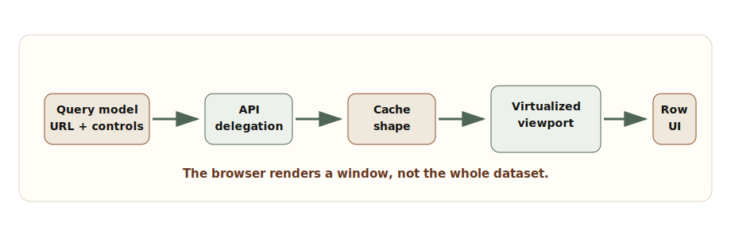

# Chapter 3: High-Density Data Management

**Chapter objective:** Design frontend data systems for large-scale tables, feeds, and dashboards — with proper query delegation, pagination, virtualization, cache discipline, and memory safety.

**Why this matters:** High-density data screens are a sharp test of frontend seniority. A table that works with 50 records in local development fails badly with 500,000 records, rapidly changing filters, partial API failures, editable rows, keyboard navigation, and business users who expect export, compare, and audit workflows.

---

The hard part of frontend data management is not displaying a table. It is keeping the table fast, accessible, consistent, and memory-safe when data volume, filters, user actions, permissions, and business rules all grow at the same time.

Small tables forgive vague architecture. Large tables do not. Infinite feeds do not. Operational dashboards do not.

> *A high-density frontend is not a table component. It is a contract between query shape, backend delegation, cache behavior, viewport rendering, interaction design, and operational safety.*

## Why This Matters for Senior Frontend Roles

Senior frontend engineers are expected to ask where work should happen. Should sorting happen in the browser or in the API? Should search be local, delegated, or hybrid? Should filters live in the URL? Should cached pages be normalized by entity or kept as page slices? How long can rows be stale? How do we prevent background refresh from clobbering an edit? How do screen readers understand a virtualized grid where many DOM rows do not exist?

Those are architecture questions. They affect backend contracts, product behavior, design system primitives, telemetry, and the performance budget. Treating them as component props produces fragile systems.

## Problem Framing and Constraints

Before designing a dense data view, name the product job. A compliance reviewer scanning audit entries has different needs from a support agent triaging tickets or an executive reading a summary dashboard.

Clarify:

- Expected data volume: rows, columns, nested entities, and retention window.
- Interaction model: scan, edit, compare, bulk select, drill down, export, approve, or monitor.
- Query shape: filters, sorting, search, grouping, and aggregation.
- Freshness requirement: real time, near real time, refresh on action, or stable snapshot.
- Consistency requirement: latest state, point-in-time state, or auditable sequence.
- Device constraints: desktop-only, tablet, low-memory browser, or shared workstation.
- Accessibility constraints: table semantics, keyboard range selection, focus retention, and announcements.

## Architecture Model

A dense data screen needs four boundaries.

**Query boundary** — defines what the user is asking for: filters, search, sort, page cursor, column visibility, grouping, time range, and permission scope. Often URL state because users expect shareable, restorable views.

**Delegation boundary** — defines what the backend must do. Expensive filtering, sorting, authorization, and aggregation usually belong server-side. Browser-side filtering is useful only when the dataset is intentionally small or already bounded.

**Cache boundary** — defines what the frontend remembers. Page slices are simple. Entity-normalized caches reduce duplication. Infinite-query caches preserve scroll continuity but can grow without discipline.

**Viewport boundary** — defines what the DOM renders. Virtualization does not reduce data volume by itself. It reduces DOM nodes and layout work. It must be paired with stable measurement, keyboard behavior, and accessible semantics.



_High-Density Table Architecture — Dense data views need a deliberate flow from query model to API delegation, cache shape, virtualized viewport, and row rendering._

## Query State Model

Treat query state as a product contract, not a random collection of component state. The query should be serializable, comparable, and safe to pass to an API.

```ts
export type SortDirection = "asc" | "desc";

export type DataViewQuery = {
  tenantId: string;
  search?: string;
  filters: Array<{
    field: "status" | "owner" | "priority" | "createdAt" | "region";
    operator: "eq" | "in" | "range" | "contains";
    value: string | string[] | { from?: string; to?: string };
  }>;
  sort: Array<{
    field: string;
    direction: SortDirection;
  }>;
  pagination: {
    mode: "cursor" | "offset";
    cursor?: string;
    offset?: number;
    limit: number;
  };
  visibleColumns: string[];
  density: "compact" | "comfortable";
  snapshotAt?: string;
};
```

If a filter cannot be represented in this model, it is probably not ready for a stable URL, cache key, or API contract. If a field should not be user-controllable, it should not appear in the query model.

## Cursor vs Offset Pagination

**Offset pagination** works well for stable datasets, administrative screens, and cases where users jump to a known page. It becomes fragile when rows are inserted or deleted while browsing — page 3 may not mean the same thing after the dataset changes.

**Cursor pagination** is better for feeds, activity logs, and data that changes frequently. It anchors continuation to a stable position. Cursor pagination is harder to expose as a direct page number, but preserves continuity and performs better at scale.

## Cache Keys and Invalidation

Dense data views fail because cache keys are too coarse. If filters, sorting, permissions, and visible columns affect the response, they must influence the query key.

```ts
export const dataViewKeys = {
  all: ["data-view"] as const,
  list: (query: DataViewQuery) =>
    [
      ...dataViewKeys.all,
      "list",
      query.tenantId,
      {
        search: query.search ?? "",
        filters: query.filters,
        sort: query.sort,
        paginationMode: query.pagination.mode,
        limit: query.pagination.limit,
        visibleColumns: query.visibleColumns,
        snapshotAt: query.snapshotAt ?? "live"
      }
    ] as const,
  row: (tenantId: string, rowId: string) =>
    [...dataViewKeys.all, "row", tenantId, rowId] as const
};
```

A stable key should represent the data contract. If a query key ignores a filter, users will eventually see stale or incorrect rows.

Multiple invalidation paths exist: filter changes, sort changes, row edits, bulk actions, background refresh, and permission changes. Treating all of them as "refetch everything" is simple but can be slow and disruptive. Background refresh should reconcile without destroying viewport continuity.

## Virtualized Viewport

Virtualization trades DOM size for measurement and scroll coordination. The viewport renders visible rows plus overscan. Too little overscan causes blank flashes during fast scroll; too much defeats the point.

Variable-height rows require a measurement layer. If row height depends on async content, images, expandable sections, or wrapped text, the virtualization model must update measurements without causing scroll jumps.

```ts
type VirtualWindow<Item> = {
  items: Item[];
  startIndex: number;
  endIndex: number;
  totalCount?: number;
  measureRow: (index: number, element: HTMLElement | null) => void;
  loadMoreBefore?: () => Promise<void>;
  loadMoreAfter?: () => Promise<void>;
};

function renderVirtualRows<Item>(
  window: VirtualWindow<Item>,
  renderRow: (item: Item, index: number) => React.ReactNode
) {
  return window.items.map((item, offset) => {
    const index = window.startIndex + offset;

    return (
      <div
        key={index}
        ref={(element) => window.measureRow(index, element)}
        role="row"
        aria-rowindex={index + 1}
      >
        {renderRow(item, index)}
      </div>
    );
  });
}
```

In production, use a proven virtualization library rather than hand-rolling this logic. The adapter is valuable because it keeps the application boundary clear.

## Performance Budget

Performance budgets for dense data screens should be explicit — covering not just initial load but scroll smoothness, filter response, memory ceiling, and edit latency.

```ts
export const denseDataPerformanceBudget = {
  firstUsefulRows: "under 2.5s on target device",
  filterInteractionResponse: "under 150ms before loading feedback",
  scrollFrameBudget: "no long tasks during ordinary scroll",
  maxMountedRows: 120,
  maxCachedPagesPerQuery: 5,
  rowEditFeedback: "under 100ms optimistic or pending state",
  backgroundRefresh: "must not reset scroll or active edit"
} as const;
```

## Trade-offs

| Decision | Option A | Option B | Senior trade-off |
| --- | --- | --- | --- |
| Filtering | Backend delegation | Browser-side filtering | Backend delegation scales and protects permission rules. Browser filtering is faster only for intentionally bounded datasets. |
| Pagination | Cursor | Offset | Cursor handles changing datasets and large offsets better. Offset is simpler for page-jump workflows and stable reports. |
| Cache shape | Page slices | Entity-normalized cache | Page slices are simple and match infinite queries. Entity normalization reduces duplication and improves row edit reconciliation. |
| Virtualization | Windowed rendering | Full DOM rendering | Windowing protects layout and memory. Full rendering can preserve native browser find and simpler semantics for small data. |
| Freshness | Background refresh | User-triggered refresh | Background refresh keeps data current but can disrupt edits. User refresh preserves stability but may show stale state longer. |

## Failure Modes

High-density data systems fail in familiar ways:

- Sorting happens client-side on one page, so the displayed order is globally wrong.
- A filter is omitted from the cache key and users see stale rows.
- Background refresh replaces rows while the user is editing a cell.
- Infinite scrolling keeps every page forever and memory usage climbs across the session.
- Virtualized rows lose focus when DOM nodes are recycled.
- Row selection is tied to visible index instead of stable row ID.
- Bulk actions apply to "visible rows" when the user thought they selected all matching rows.
- Screen readers cannot understand row count or position because virtualized semantics were skipped.

> **Dense data failure test**
>
> Change filters quickly, scroll aggressively, edit a row, lose network, restore network, and then perform a bulk action. If the result is ambiguous, the architecture is not finished.

## Interview Lens

Start with product semantics:

> I would first clarify whether users need a stable report, a live operational view, or an exploratory table. That decides pagination, freshness, caching, and virtualization choices.

Then explain: typed query model → backend delegation → cursor vs offset decision → cache keys including all response-affecting fields → bounded virtual viewport with overscan and measurement → accessible row semantics with stable IDs → instrumentation for latency, scroll performance, cache invalidation, and memory.

## Key Takeaways

- Dense data screens require four explicit boundaries: query, delegation, cache, and viewport.
- Query state should be typed, serializable, and URL-safe.
- Global filtering, sorting, and authorization belong server-side for unbounded datasets.
- Cache keys must include every field that affects the response.
- Row identity must be stable, never based on visible index.
- Virtualization reduces DOM nodes, not data volume — it must be paired with accessibility semantics.
- Memory budget limits both cached pages and mounted rows.

## Production Checklist

- [ ] Query model is typed, serializable, and safe for URL state.
- [ ] Backend owns authorization, global filtering, sorting, search, and aggregation where data is unbounded.
- [ ] Pagination mode is chosen based on product semantics and dataset volatility.
- [ ] Cache keys include filters, sorting, pagination mode, visible columns, tenant scope, and snapshot state.
- [ ] Row identity is stable and never based only on visible index.
- [ ] Virtualized viewport has overscan, measurement, and focus recovery.
- [ ] Edits, background refresh, and cache invalidation have explicit merge behavior.
- [ ] Bulk actions distinguish selected visible rows from all matching rows.
- [ ] Accessibility semantics are tested with keyboard and assistive technology.
- [ ] Memory budget limits cached pages and mounted rows.
- [ ] Telemetry tracks query latency, long tasks, scroll performance, cache invalidation, and edit conflicts.

---

[← Chapter 2: Real-Time Frontend Systems](02-real-time-frontend-systems.md) | [Table of Contents](../README.md) | [Chapter 4: Dynamic and Scalable UI →](04-dynamic-scalable-ui.md)

*Source: [High-Density Data Management in Frontend: Virtualization, Pagination, Caching, and Memory Discipline](https://blog.ranveerkumar.com/articles/high-density-data-management-in-frontend-virtualization-pagination-caching-memory)*
