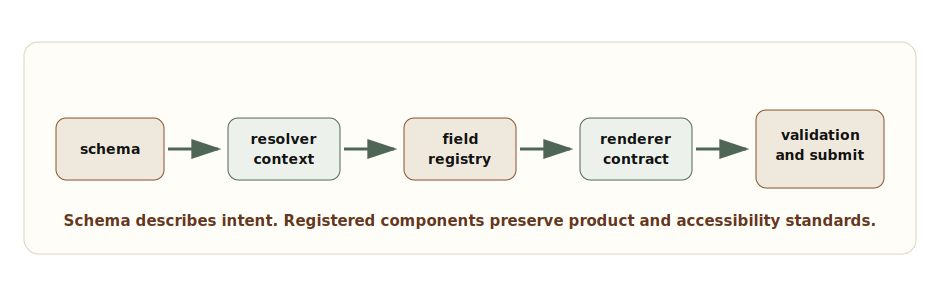

# Chapter 4: Dynamic and Scalable UI

**Chapter objective:** Design schema-driven UI systems with constrained schemas, field registries, validation orchestration, role-based visibility, workflow-state screens, and notification routing — without letting flexibility become unbounded complexity.

**Why this matters:** Dynamic UI is powerful but dangerous. Without clear schema models, renderer boundaries, and governance, configurable UI becomes a second programming language nobody wants to maintain.

---

The idea is attractive: product teams define forms, screens, workflows, and notifications with configuration instead of waiting for every change to become a release. But the failure mode is severe — a vague schema becomes an untyped product language, conditional visibility becomes business logic hidden in JSON, and notifications become noisy because every feature thinks its message is urgent.

> *Schema-driven UI should narrow the ways teams build product experiences. If it creates unlimited local expression, it is not a platform. It is a distributed maintenance problem.*

## Why This Matters for Senior Frontend Roles

Senior frontend engineers are often asked to design systems that let teams move faster without losing consistency. Dynamic UI is one of the hardest versions of that problem because it turns product variability into runtime behavior.

The senior questions are:

- Which parts of the UI are safe to configure?
- Which rules belong in schema, workflow state, server policy, or code?
- How do we validate changes before they reach users?
- How do we preserve accessibility when fields are composed dynamically?
- How do we keep role-based visibility from becoming a client-side security model?
- How do notifications respect priority, channel, timing, and user context?
- How do we observe which schema version caused a production problem?

Dynamic systems need more boundaries than static systems, not fewer.

## Problem Framing and Constraints

Before creating a schema-driven UI, name the variability you are trying to support. Common valid use cases:

- Forms where fields vary by product, region, role, or workflow state.
- Configurable detail screens where sections appear based on entity type.
- Guided workflows where steps depend on prior answers.
- Notification systems where messages route by severity, channel, and user preference.
- Internal platform surfaces where teams assemble approved modules.

Common invalid use cases:

- Avoiding product decisions by making every layout configurable.
- Moving sensitive permission rules to the browser.
- Encoding complex business logic in JSON without versioning, tests, or ownership.

The goal is controlled flexibility. The schema should describe product intent in a constrained language. The renderer should translate that intent into approved UI components.

## Architecture Model

A schema-driven UI has six boundaries:

1. **Schema boundary** — the allowed language: field types, sections, actions, visibility rules, validation rules, workflow states.
2. **Resolver boundary** — evaluates schema against runtime context (role, locale, feature flags, workflow state). Produces a render plan, not arbitrary JSX.
3. **Registry boundary** — maps schema field types to approved components. Enforces design system, accessibility, and analytics hooks.
4. **Validation boundary** — orchestrates synchronous, conditional, asynchronous, and server validation.
5. **Submit boundary** — turns UI state into a domain command. Does not leak component state directly to the backend.
6. **Governance boundary** — controls versioning, review, tests, rollout, and rollback of schema changes.



_Schema-Driven Rendering Pipeline — A safe dynamic UI pipeline resolves schema against context, selects registered renderers, validates input, and submits through explicit contracts._

## Schema Model

A schema model should be expressive enough to represent product variation but constrained enough to keep the renderer predictable.

```ts
export type VisibilityRule =
  | { kind: "role"; allowedRoles: Array<"viewer" | "editor" | "admin"> }
  | { kind: "fieldEquals"; fieldId: string; value: string | boolean }
  | { kind: "workflowState"; states: string[] };

export type ValidationRule =
  | { kind: "required"; message: string }
  | { kind: "pattern"; regex: string; message: string }
  | { kind: "asyncUnique"; endpoint: string; message: string }
  | { kind: "serverPolicy"; policyId: string };

export type FieldSchema = {
  id: string;
  type: "text" | "select" | "date" | "money" | "textarea" | "checkbox";
  label: string;
  description?: string;
  defaultValue?: unknown;
  options?: Array<{ label: string; value: string }>;
  visibility?: VisibilityRule[];
  validation?: ValidationRule[];
  analyticsKey?: string;
};

export type ScreenSchema = {
  id: string;
  version: number;
  title: string;
  sections: Array<{
    id: string;
    title: string;
    fields: FieldSchema[];
  }>;
  submit: {
    command: string;
    successNotification: string;
  };
};
```

This model intentionally does not allow arbitrary layout, arbitrary code, or arbitrary expressions. Dynamic UI works best when the schema is a product language, not a general programming language.

## Field Registry

The registry is where schema meets implementation. Each field type declares its component, value contract, accessibility expectations, and validation display behavior.

```tsx
type FieldRendererProps<TValue> = {
  field: FieldSchema;
  value: TValue;
  error?: string;
  disabled?: boolean;
  onChange: (value: TValue) => void;
};

type FieldRenderer<TValue = unknown> = {
  component: React.ComponentType<FieldRendererProps<TValue>>;
  parseValue: (raw: unknown) => TValue;
  serializeValue: (value: TValue) => unknown;
  supports: {
    required: boolean;
    asyncValidation: boolean;
    describedBy: boolean;
  };
};

export const fieldRegistry = {
  text: textFieldRenderer,
  select: selectFieldRenderer,
  date: dateFieldRenderer,
  money: moneyFieldRenderer,
  textarea: textareaFieldRenderer,
  checkbox: checkboxFieldRenderer
} satisfies Record<FieldSchema["type"], FieldRenderer>;
```

The registry lets you reject unknown field types early, version field behavior, and keep accessibility obligations near the component contract.

## Validation Orchestration

A field may need required checks, formatting checks, conditional checks based on another field, async uniqueness checks, and final server validation. If each field owns that workflow independently, user experience fragments quickly.

```ts
type ValidationResult = {
  fieldErrors: Record<string, string>;
  formErrors: string[];
  canSubmit: boolean;
};

export async function validateScreen(
  schema: ScreenSchema,
  values: Record<string, unknown>,
  context: { role: string; workflowState: string }
): Promise<ValidationResult> {
  const fieldErrors: Record<string, string> = {};
  const formErrors: string[] = [];

  for (const section of schema.sections) {
    for (const field of section.fields) {
      if (!isVisible(field, values, context)) {
        continue;
      }

      for (const rule of field.validation ?? []) {
        const error = await evaluateRule(rule, field, values, context);

        if (error) {
          fieldErrors[field.id] = error;
          break;
        }
      }
    }
  }

  return {
    fieldErrors,
    formErrors,
    canSubmit: Object.keys(fieldErrors).length === 0 && formErrors.length === 0
  };
}
```

This pipeline also provides a place to debounce async checks, cancel stale validations, and map server errors back to fields after submit.

## Role-Based Visibility and Workflow State

Role-based visibility is not authorization — it is presentation. The backend must still enforce which fields can be read, written, approved, exported, or submitted.

The frontend should use visibility rules to reduce clutter and guide the user, but sensitive data should never be sent to the browser simply because the current schema hides it.

> **Security boundary**
>
> Dynamic UI can represent permissions, but it must not become the permission source. Treat schema visibility as user experience, not enforcement.

## Notification Routing and Priority

Without a priority model, every feature asks for a toast, banner, modal, email, or badge. Users learn to ignore everything.

```ts
export const notificationPriorityMatrix = {
  critical: {
    surfaces: ["modal", "banner", "auditLog"],
    interrupt: true,
    requiresAction: true,
    examples: ["payment blocked", "security policy violation"]
  },
  warning: {
    surfaces: ["banner", "inbox"],
    interrupt: false,
    requiresAction: true,
    examples: ["validation conflict", "approval nearing deadline"]
  },
  info: {
    surfaces: ["toast", "inbox"],
    interrupt: false,
    requiresAction: false,
    examples: ["draft saved", "background import completed"]
  },
  ambient: {
    surfaces: ["badge", "activityFeed"],
    interrupt: false,
    requiresAction: false,
    examples: ["comment added", "status changed"]
  }
} as const;
```

The channel is a product decision, not a convenience choice. Routing notifications based on priority, user context, and actionability respects user attention.

## Trade-offs

| Decision | Option A | Option B | Senior trade-off |
| --- | --- | --- | --- |
| UI variability | Schema-driven | Code-defined screens | Schema enables faster configuration but requires governance, versioning, validation, and tooling. Code-defined screens are simpler for unique workflows. |
| Rule execution | Client resolver | Server policy | Client resolver improves responsiveness and reduces clutter. Server policy is required for security and final authority. |
| Field registry | Central registry | Feature-owned field renderers | Central registry protects consistency and accessibility. Feature renderers can move faster but fragment behavior. |
| Validation | Orchestrated pipeline | Per-field local logic | Pipeline improves consistency and observability. Local logic is quicker for simple static forms. |
| Notifications | Priority router | Direct toast calls | Priority router reduces noise and supports channel policy. Direct calls are simple but become chaotic at scale. |

## Failure Modes

Dynamic UI systems fail when flexibility outruns ownership:

- A schema version references a field type that the deployed frontend does not support.
- Conditional visibility hides a required field and blocks submit.
- Async validation returns after the user changed the value and overwrites the current error state.
- Role visibility hides an action, but the backend still accepts an unauthorized command.
- A workflow state change invalidates the current screen while the user is typing.
- Notifications duplicate across toast, banner, and inbox.
- A schema rollout breaks one tenant because configuration was not validated against real policy context.

Recovery requires version checks, schema validation, safe fallback screens, feature-flagged rollout, and server-side enforcement. A dynamic system should fail closed for unsupported actions and fail helpfully for unsupported fields.

> **Dynamic UI failure test**
>
> Ship a schema change without a frontend deploy, change workflow state while a form is open, revoke a permission, and return a server validation error. If the user experience becomes incoherent, the schema system needs stronger contracts.

## Interview Lens

Start by limiting scope:

> I would not make the entire UI configurable. I would define which screen regions, fields, visibility rules, validations, and notifications are safe to represent in schema, then keep rendering constrained through a registry.

Then walk through: constrained schema language → context resolver → field registry → validation pipeline → submit boundary → notification priority router → governance.

That answer shows you can create flexibility without letting configuration become unbounded complexity.

## Key Takeaways

- Schema-driven UI must be intentionally constrained — it is a product language, not a general programming language.
- A resolver turns schema and context into a render plan, not arbitrary JSX.
- The field registry enforces component mapping, value contracts, accessibility, and analytics hooks.
- Validation must be orchestrated centrally to handle sync, conditional, async, and server checks.
- Role visibility is presentation only; server policy enforces permissions.
- Notifications require a priority model to avoid alert fatigue.
- Schema changes need versioning, automated validation, staged rollout, and rollback.

## Production Checklist

- [ ] Schema language is intentionally constrained and versioned.
- [ ] Unknown field types, unsupported schema versions, and invalid rules fail safely.
- [ ] Resolver output is a render plan, not arbitrary executable UI.
- [ ] Field registry owns component mapping, value parsing, errors, accessibility, and analytics hooks.
- [ ] Visibility rules are presentation only; server policy enforces permissions.
- [ ] Validation pipeline handles sync, conditional, async, and server validation without stale responses.
- [ ] Workflow state changes have clear behavior for active forms.
- [ ] Notification priority determines channel, interruption level, dedupe, and actionability.
- [ ] Schema changes have automated validation, review, staged rollout, and rollback.
- [ ] Telemetry includes schema ID, version, field ID, workflow state, role, validation outcome, and submit result.

---

[← Chapter 3: High-Density Data Management](03-high-density-data-management.md) | [Table of Contents](../README.md) | [Chapter 5: Frontend State Architecture →](05-frontend-state-architecture.md)

*Source: [Dynamic and Scalable UI: Schema-Driven Forms, Configurable Screens, and Notification Systems](https://blog.ranveerkumar.com/articles/dynamic-scalable-ui-schema-driven-forms-configurable-screens-notification-systems)*
