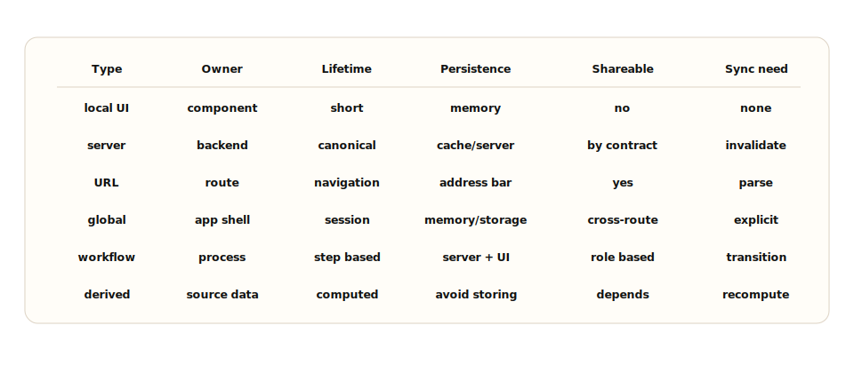
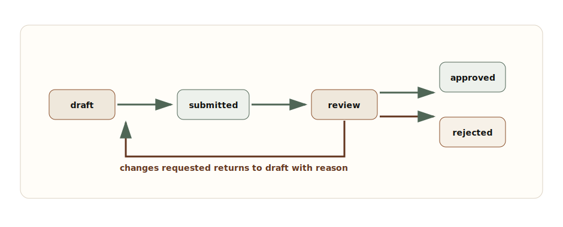

# Chapter 5: Frontend State Architecture

**Chapter objective:** Build a taxonomy for classifying state by owner, lifetime, persistence, and sync need — and use that taxonomy to choose the right storage boundary before choosing a library.

**Why this matters:** Most frontend bugs are state bugs wearing different clothes. A stale cache looks like a data bug. A duplicated derived value looks like a rendering bug. A global store used as a convenience layer looks like an architecture bug. Naming state ownership early prevents all of them.

---

A senior frontend engineer does not ask "which state library should I use?" first. They ask: what type of state is this, who owns it, how long does it live, who needs to share it, where should it persist, and what can make it stale?

State architecture is one of the fastest ways to separate component thinking from system thinking.

> *State architecture is not choosing Redux, Zustand, React Query, or URL params. It is deciding which data belongs to which owner and how it changes over time.*

## Why This Matters for Senior Frontend Roles

Senior frontend engineers are expected to prevent state bugs by naming ownership early. They ask:

- Is this value created by the user, the server, the URL, the app shell, or a workflow?
- Does it survive navigation, refresh, login, or tab restore?
- Is it shareable?
- Can it be stale?
- Does it need optimistic updates?
- Does it require validation?
- Is it derived from another source and therefore should not be stored?
- Does it belong in a state machine because transitions matter?

State libraries are useful after those answers exist. They are dangerous before.

## Problem Framing and Constraints

Imagine a multi-step approval workflow. The page has:

- Server data for the request
- Local UI state for expanded sections
- URL state for selected tab and filters
- Form state for comments
- Global application state for current user and feature flags
- Workflow state for draft, submitted, approved, rejected, or needs changes

If all of this goes into one global store, every change becomes harder to reason about. If all of it stays local, the workflow becomes hard to restore, share, observe, and coordinate across routes.

Good state architecture separates:

- **Owner:** browser, URL, server, app shell, feature, workflow, or derived computation.
- **Lifetime:** render, component, route, session, persisted, server canonical.
- **Persistence:** none, URL, memory cache, storage, server.
- **Shareability:** local only, route shareable, cross-route, cross-tab, cross-user.
- **Sync need:** never synced, refetched, invalidated, optimistic, real time.

## Architecture Model



_State Classification Matrix — Classify state by owner, lifetime, persistence, shareability, and sync need before choosing storage or libraries._

Use the narrowest state boundary that preserves the user experience.

**Local state** — belongs inside a component or feature when it is purely presentational: open/closed, hover intent, focused row, temporary disclosure, local tab within a panel. Lift it only as far as needed.

**Server state** — belongs to the backend. The frontend may cache it, display it, optimistically update it, or invalidate it, but it does not own truth. Server state can become stale.

**URL state** — belongs in the route. Filters, sort order, selected tab, search query, and pagination cursor often belong here because users expect refresh, sharing, back/forward, and deep links to work.

**Global state** — belongs to the app shell only when it is truly cross-cutting: authenticated user summary, theme, locale, feature flag snapshot, global navigation, or active organization.

**Form state** — belongs to the form lifecycle. It may start from server data, but editing creates a draft. That draft needs validation, dirty tracking, reset behavior, and conflict rules.

**Workflow state** — belongs to the process. It defines allowed transitions, roles, side effects, and recovery paths.

**Derived state** — should usually be computed from sources. Storing derived state creates drift unless you have a clear invalidation rule.

## State Classification Code

```ts
export enum FrontendStateKind {
  LocalUi = "local-ui",
  Server = "server",
  Url = "url",
  GlobalApp = "global-app",
  FormDraft = "form-draft",
  Workflow = "workflow",
  Derived = "derived"
}

export type StateClassification = {
  kind: FrontendStateKind;
  owner: "component" | "route" | "backend" | "app-shell" | "workflow";
  lifetime: "render" | "component" | "route" | "session" | "persistent";
  persistence: "none" | "url" | "memory-cache" | "storage" | "server";
  shareability: "local" | "route" | "cross-route" | "cross-tab" | "cross-user";
  staleRisk: "none" | "low" | "medium" | "high";
  syncStrategy: "none" | "derive" | "invalidate" | "optimistic" | "realtime";
};
```

This makes state review concrete. If a value has `owner: "backend"` and `staleRisk: "high"`, it probably does not belong in a generic global store without invalidation.

## URL State for Filters

URL state is underrated. If a screen can be refreshed, shared, bookmarked, or navigated with back/forward, route-level state should usually live in the URL.

```ts
type InvoiceFilterState = {
  status?: "open" | "paid" | "overdue";
  owner?: string;
  page?: string;
  sort?: "created-desc" | "created-asc" | "amount-desc";
};

export function readInvoiceFilters(params: URLSearchParams): InvoiceFilterState {
  return {
    status: parseStatus(params.get("status")),
    owner: params.get("owner") ?? undefined,
    page: params.get("page") ?? undefined,
    sort: parseSort(params.get("sort"))
  };
}

export function writeInvoiceFilters(filters: InvoiceFilterState) {
  const params = new URLSearchParams();

  if (filters.status) params.set("status", filters.status);
  if (filters.owner) params.set("owner", filters.owner);
  if (filters.page) params.set("page", filters.page);
  if (filters.sort) params.set("sort", filters.sort);

  return params.toString();
}
```

URL state must be serializable, compact, and stable. Do not put sensitive data, large drafts, or volatile local UI state in the URL.

## Server State Query Keys

Server state needs cache identity. Query keys should include every field that changes the server response.

```ts
export const invoiceKeys = {
  all: ["invoices"] as const,
  list: (tenantId: string, filters: InvoiceFilterState) =>
    [
      ...invoiceKeys.all,
      "list",
      tenantId,
      {
        status: filters.status ?? "all",
        owner: filters.owner ?? "any",
        page: filters.page ?? "first",
        sort: filters.sort ?? "created-desc"
      }
    ] as const,
  detail: (tenantId: string, invoiceId: string) =>
    [...invoiceKeys.all, "detail", tenantId, invoiceId] as const
};
```

If a cache key omits `tenantId`, `status`, or `sort`, the user can see data that belongs to the wrong query. Cache bugs are often state classification bugs.

## Workflow State Machines

Workflow state is different from UI state. It has allowed transitions, guards, side effects, and role-specific actions. Model it explicitly.



_Approval Workflow State Machine — Workflow state defines allowed transitions and recovery paths for a multi-step approval flow._

```ts
type ApprovalState = "draft" | "submitted" | "review" | "approved" | "rejected";
type ApprovalEvent =
  | { type: "submit"; actorRole: "author" }
  | { type: "startReview"; actorRole: "reviewer" }
  | { type: "approve"; actorRole: "reviewer" }
  | { type: "reject"; actorRole: "reviewer"; reason: string }
  | { type: "requestChanges"; actorRole: "reviewer"; reason: string };

export function transitionApproval(
  state: ApprovalState,
  event: ApprovalEvent
): ApprovalState {
  switch (state) {
    case "draft":
      return event.type === "submit" ? "submitted" : state;
    case "submitted":
      return event.type === "startReview" ? "review" : state;
    case "review":
      if (event.type === "approve") return "approved";
      if (event.type === "reject") return "rejected";
      if (event.type === "requestChanges") return "draft";
      return state;
    default:
      return state;
  }
}
```

The client state machine should guide the UI. The backend must enforce transitions.

## Common Anti-Patterns

The most common anti-pattern is copying server state into a global client store "so components can access it." That bypasses cache invalidation and turns stale state into product behavior.

Another common anti-pattern is storing derived state instead of deriving it. If `subtotal`, `tax`, and `total` are all independently stored, one of them will drift.

A third: keeping URL-shareable state in component local state. Users who refresh or share a link lose their context.

## Trade-offs

| Decision | Option A | Option B | Senior trade-off |
| --- | --- | --- | --- |
| Filters | URL state | Local component state | URL state supports sharing, refresh, and history. Local state is simpler for ephemeral controls. |
| Server data | Query/cache layer | Global store copy | Cache layers support invalidation and freshness. Global copies create stale data unless carefully synchronized. |
| Workflow | State machine | Boolean flags | State machines make transitions explicit. Booleans are quick but break as flows grow. |
| Forms | Local draft state | Immediate server mutation | Draft state supports validation and review. Immediate mutation can work for autosave but needs conflict handling. |
| Derived values | Compute from source | Store separately | Computation prevents drift. Stored derived values need invalidation rules. |

## Failure Modes

State architecture failures are predictable:

- A global store holds server data that never invalidates.
- A URL cannot restore the user's filtered view after refresh.
- A form draft overwrites newer server data after the page sits open.
- Two components store the same selection and disagree.
- A workflow uses booleans like `isSubmitted` and `isApproved`, allowing impossible combinations.
- Derived totals drift from line items.
- A cache key omits tenant, filter, or role context.
- Optimistic state is never reconciled after server rejection.

> **State architecture failure test**
>
> Refresh the route, go back and forward, change filters, leave a form open, update the same entity elsewhere, and return. If the UI cannot explain what changed, state ownership is unclear.

## Interview Lens

Start with taxonomy:

> Before choosing a state library, I would classify state by owner, lifetime, persistence, shareability, and sync needs. Then I would choose the narrowest storage boundary that preserves the user experience.

Then explain the seven categories: local UI → URL state → server cache with query keys → form draft → global app shell → workflow state machine → derived computed values.

This demonstrates architecture thinking because it separates state ownership from library preference.

## Key Takeaways

- State classification precedes library selection.
- Use the narrowest state boundary that preserves the user experience.
- Server state has a canonical owner — the backend. The frontend caches and invalidates.
- URL state supports sharing, restoration, and navigation history.
- Global state is for cross-cutting app concerns only, not convenience.
- Workflow state needs explicit transitions to prevent impossible combinations.
- Derived state should be computed from sources, not stored and synced.

## Production Checklist

- [ ] Every important state value has a named owner.
- [ ] State lifetime is explicit: render, component, route, session, persistent, or server canonical.
- [ ] URL state is used for shareable and restorable route context.
- [ ] Server state stays in a cache/query layer with complete query keys.
- [ ] Global state is limited to cross-cutting app concerns.
- [ ] Form state has dirty tracking, validation, reset, submit, and conflict behavior.
- [ ] Workflow state has explicit transitions and server authority.
- [ ] Derived state is computed unless there is a documented invalidation rule.
- [ ] Optimistic state has reconciliation and rollback.
- [ ] Sensitive state is not stored in URLs or unprotected browser storage.
- [ ] Telemetry captures stale state, failed transitions, conflict rates, and restore failures.

---

[← Chapter 4: Dynamic and Scalable UI](04-dynamic-scalable-ui.md) | [Table of Contents](../README.md) | [Chapter 6: Frontend Performance Architecture →](06-frontend-performance-architecture.md)

*Source: [Frontend State Architecture: Local State, Server State, URL State, Global State, and Workflow State](https://blog.ranveerkumar.com/articles/frontend-state-architecture-local-server-url-global-workflow-state)*
