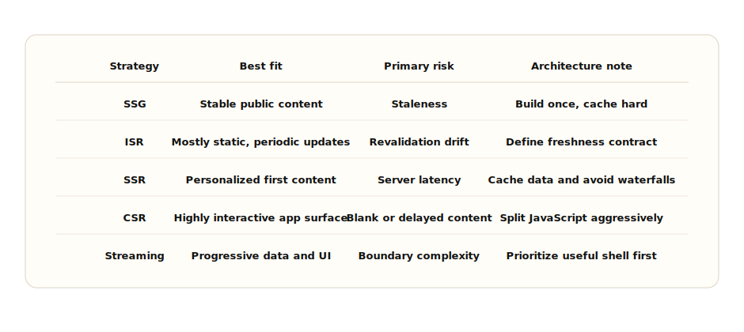

# Chapter 6: Frontend Performance Architecture

**Chapter objective:** Design performance as a structural property of the frontend system — through rendering strategy, hydration control, bundle discipline, asset governance, and real-user measurement — not as a post-release audit.

**Why this matters:** A slow page is rarely slow because one engineer forgot an optimization trick. It is slow because the architecture allowed too much JavaScript, the wrong rendering strategy, too many blocking resources, or ungoverned third-party code. Performance maturity is measured by whether teams can preserve user experience as the product grows.

---

Frontend performance is not fixed by running Lighthouse before release. It is designed through rendering strategy, bundle discipline, hydration control, asset governance, third-party script policy, and continuous measurement.

> *Performance is not a final audit. It is a contract between product experience, rendering strategy, code ownership, asset policy, and production measurement.*

## Why This Matters for Senior Frontend Roles

Senior frontend engineers make performance predictable. They cannot treat it as a heroic cleanup phase. They design routes, data loading, component boundaries, and operational budgets so regressions are harder to introduce and easier to diagnose.

The senior questions are specific:

- Which rendering strategy best serves this route: SSG, ISR, SSR, CSR, or streaming?
- Which content must appear before JavaScript is ready?
- Which interactions require hydration, and which can remain server-rendered?
- How much JavaScript can this route afford?
- Which images determine LCP?
- Which scripts are allowed to block, defer, or load after interaction?
- Which metrics matter in lab testing, and which require real-user monitoring?
- Who owns each threshold when it fails?

## Problem Framing and Constraints

Start with the route, not the framework default. A marketing page, authenticated dashboard, searchable catalog, checkout flow, and collaborative editor have different performance constraints.

Clarify:

- Primary user journey and first useful content.
- Core Web Vitals targets: LCP, INP, CLS, plus route-specific interaction latency.
- Personalization needs and cacheability.
- Data freshness requirements.
- Device profile and network assumptions.
- JavaScript required before the route is useful.
- Above-the-fold image and font strategy.
- Third-party scripts and business owner.
- Observability: lab checks, RUM, release correlation, and alert thresholds.

## Architecture Model

Think about performance in layers.

**Route layer** — decides rendering strategy, cache behavior, data dependencies, and loading boundaries. A slow route often has the wrong work in the wrong place.

**Component layer** — decides hydration cost. A server-rendered page can still be expensive if every leaf becomes a client component. Interactive islands should be deliberate.

**Asset layer** — decides images, fonts, CSS, and media. The LCP image, font loading strategy, and CSS delivery path often matter more than small micro-optimizations.

**JavaScript layer** — decides bundle size, parse cost, execution cost, and interaction responsiveness. INP failures are often architecture failures: too much synchronous work, too much hydration, too much state churn, or expensive third-party code.

**Observability layer** — decides whether teams can see the problem in production. Lab metrics are useful, but real-user monitoring reveals device, network, geography, browser, route, and release impact.



_Rendering Strategy Decision Matrix — Rendering strategy should follow freshness, personalization, cacheability, interactivity, and first-content requirements._

## Rendering Decision Helper

```ts
export type RenderingStrategy = "ssg" | "isr" | "ssr" | "csr" | "streaming";

export type RoutePerformanceProfile = {
  route: string;
  publicContent: boolean;
  personalizedAboveFold: boolean;
  dataFreshness: "static" | "minutes" | "request" | "live";
  interactionBeforeUseful: boolean;
  seoCritical: boolean;
  slowDataDependencies: boolean;
};

export function recommendRenderingStrategy(
  profile: RoutePerformanceProfile
): RenderingStrategy {
  if (profile.slowDataDependencies && !profile.interactionBeforeUseful) {
    return "streaming";
  }

  if (profile.personalizedAboveFold || profile.dataFreshness === "request") {
    return "ssr";
  }

  if (profile.publicContent && profile.dataFreshness === "static") {
    return "ssg";
  }

  if (profile.publicContent && profile.dataFreshness === "minutes") {
    return "isr";
  }

  return "csr";
}
```

The key is not the function — it is the input model. It forces a route owner to name freshness, personalization, SEO, interactivity, and slow dependencies.

## Hydration Cost

Hydration is where server-rendered HTML becomes interactive. It is also a common hidden cost. A page can have excellent HTML delivery and still feel sluggish if the browser must download, parse, execute, and hydrate too much JavaScript before responding to input.

Hydration control is architectural:
- Keep static content in server components.
- Move only interactive islands to the client.
- Defer noncritical widgets.
- Split expensive controls.
- Avoid client-only providers wrapping whole routes when only one subtree needs them.

The best hydration optimization is often avoiding hydration for UI that does not need it.

## Core Web Vitals and RUM

Lab tools are controlled experiments — useful for catching obvious regressions and comparing builds. Real-user monitoring is field evidence. It shows how real devices, networks, locations, and browsers behave.

- **LCP** — usually shaped by server response, critical CSS, image loading, fonts, and route rendering.
- **INP** — usually shaped by JavaScript execution, hydration, long tasks, event handlers, and render churn.
- **CLS** — usually shaped by image dimensions, ads, late content, font swaps, and layout instability.

```ts
type WebVitalMetric = {
  name: "LCP" | "INP" | "CLS" | "FCP" | "TTFB";
  value: number;
  rating: "good" | "needs-improvement" | "poor";
  id: string;
};

export function reportWebVitals(metric: WebVitalMetric) {
  const payload = {
    metric: metric.name,
    value: metric.value,
    rating: metric.rating,
    id: metric.id,
    route: window.location.pathname,
    release: process.env.NEXT_PUBLIC_RELEASE_ID ?? "local",
    connection: navigator.connection?.effectiveType,
    userAgent: navigator.userAgent
  };

  navigator.sendBeacon("/api/web-vitals", JSON.stringify(payload));
}
```

Production reporting should always include route and release. Without that, metrics become dashboards people admire and ignore.

## Performance Budgets and Ownership

"Keep the page fast" is not a budget. "The checkout route LCP p75 must remain under 2.5 seconds on mobile field data, owned by the checkout team, with release blocking if lab LCP regresses by 20 percent" is a budget.

```ts
export const bundleBudget = {
  routes: {
    "/": { initialJsKb: 120, totalJsKb: 220 },
    "/articles/[slug]": { initialJsKb: 140, totalJsKb: 260 },
    "/dashboard": { initialJsKb: 180, totalJsKb: 420 }
  },
  shared: {
    maxClientComponentDepth: 4,
    maxThirdPartyScriptsBeforeInteractive: 0,
    maxLongTaskMs: 50
  },
  enforcement: {
    warnAtPercent: 90,
    failAtPercent: 110,
    owner: "frontend-platform"
  }
} as const;
```

Budgets fail when they are metrics without ownership.

## Third-Party Script Governance

Third-party scripts are architecture decisions because they execute on the user's device outside your release discipline. Analytics, experimentation, chat, ads, monitoring, payment widgets, and personalization scripts all carry main-thread, privacy, and reliability cost.

```ts
export const thirdPartyScriptChecklist = [
  "Business owner is named",
  "Purpose and data collected are documented",
  "Loading strategy is explicit: beforeInteractive, afterInteractive, lazyOnload, or user-triggered",
  "Script is blocked from critical rendering path unless legally or functionally required",
  "Performance impact is measured in lab and RUM",
  "Failure behavior is defined if the script does not load",
  "Privacy and consent requirements are reviewed",
  "Removal date or review cadence is documented"
] as const;
```

If nobody owns the script, the script should not own the user's main thread.

## Trade-offs

| Decision | Option A | Option B | Senior trade-off |
| --- | --- | --- | --- |
| Rendering | SSG or ISR | SSR or streaming | Static strategies maximize cacheability. SSR and streaming support personalization and freshness but add server and boundary complexity. |
| Interactivity | Hydrate broad route | Hydrate islands | Broad hydration is simpler but expensive. Islands reduce JS cost but require better component boundaries. |
| Metrics | Lab checks | RUM | Lab checks are repeatable and release-friendly. RUM captures real users and should drive ownership. |
| Images | Eager critical image | Lazy all images | Eager loading supports LCP when correct. Lazy-loading the LCP image hurts the primary experience. |
| Scripts | Feature-owned scripts | Governed registry | Feature ownership moves fast. Registry protects performance, privacy, loading strategy, and removal discipline. |

## Failure Modes

Performance failures are often systemic:

- A route becomes client-rendered because a provider was lifted too high.
- The LCP image is lazy-loaded or lacks stable dimensions.
- A third-party script blocks the main thread during interaction.
- A dashboard hydrates every card before the first useful interaction.
- Lab metrics pass while real mobile users regress after a content or traffic change.
- No team owns a budget, so regressions become everyone and nobody's problem.

Recovery design means defining what happens when a route breaks budget: CI failure, release review, owner alert, script rollback, heavy widget disable, or regression-to-release correlation.

> **Performance failure test**
>
> Throttle CPU, load the route on a mid-tier mobile profile, block a third-party script, delay the main API, and interact before hydration finishes. If the experience has no graceful path, the performance architecture is incomplete.

## Interview Lens

Start with the performance goal:

> I would define the first useful content, Core Web Vitals targets, device profile, data freshness, personalization needs, and JavaScript budget before choosing a rendering strategy.

Then walk through: rendering strategy choice → server components for non-interactive content → intentional hydration islands → LCP image and critical CSS priority → route bundle splitting → third-party script governance → lab + RUM tied to release and route ownership → budgets with thresholds and response plans.

That answer demonstrates architecture judgment instead of a bag of optimization tips.

## Key Takeaways

- Rendering strategy is a product and architecture decision, not a framework default.
- Hydration cost is architectural — keep static content on the server, hydrate only interactive islands.
- LCP, INP, and CLS are shaped by structural decisions (rendering, images, fonts, scripts).
- Performance budgets require owners, thresholds, and enforcement points to be useful.
- Lab metrics catch regressions. RUM reveals real user experience and should drive ownership.
- Third-party scripts are architecture decisions — every script needs a business owner and loading strategy.

## Production Checklist

- [ ] Route has a named first-useful-content target.
- [ ] Rendering strategy is justified by freshness, personalization, SEO, and interactivity.
- [ ] Critical content does not depend on noncritical JavaScript.
- [ ] Hydration boundaries are intentional and limited.
- [ ] LCP image strategy is explicit, including dimensions, priority, and format.
- [ ] Fonts are loaded to avoid blocking or layout instability.
- [ ] JavaScript bundles have route-level budgets.
- [ ] Third-party scripts have owners, loading strategies, and failure behavior.
- [ ] Lab checks run before release and RUM monitors production percentiles.
- [ ] Budgets include owner, threshold, enforcement point, and response plan.
- [ ] Telemetry avoids sensitive data and includes route and release context.

---

[← Chapter 5: Frontend State Architecture](05-frontend-state-architecture.md) | [Table of Contents](../README.md) | [Chapter 7: Designing Frontend Platforms →](07-frontend-platforms.md)

*Source: [Frontend Performance Architecture: Budgets, Rendering Strategy, Hydration, and Core Web Vitals](https://blog.ranveerkumar.com/articles/frontend-performance-architecture-budgets-rendering-hydration-core-web-vitals)*
