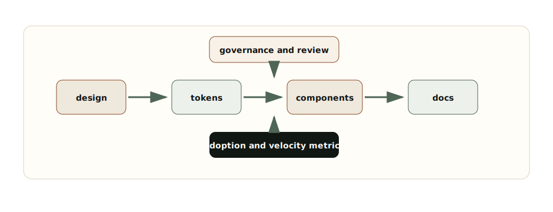

# Chapter 7: Designing Frontend Platforms

**Chapter objective:** Design a frontend platform — governed design system, token taxonomy, component APIs, documentation, versioning, migration strategy, adoption metrics, and contribution governance — that improves engineering velocity across teams.

**Why this matters:** A design system fails when it is treated as a Figma-to-React component dump. It succeeds when it becomes a governed frontend platform with measurable impact on how consistently and safely product teams ship.

---

A component library gives teams reusable UI parts. A frontend platform gives teams a reliable path for building product experiences without rediscovering visual rules, interaction behavior, accessibility requirements, state conventions, documentation patterns, release practices, and migration plans.

> *A mature design system is not a library of components. It is an operating model for turning product, design, and engineering decisions into reusable capability.*

## Why This Matters for Senior Frontend Roles

Senior frontend engineers are often expected to improve how many teams build UI — not just their own feature delivery. That means platform thinking: reducing repeated decisions, protecting accessibility, increasing consistency, lowering migration cost, and making good patterns easier to adopt than local invention.

The senior questions are:

- Which decisions should be encoded as tokens, components, patterns, or documentation?
- Which component APIs are stable enough for many teams?
- How do we make accessibility behavior default instead of optional?
- How do teams contribute without turning the platform into a collection of exceptions?
- How do we version breaking changes?
- How do we measure adoption and engineering velocity?
- How do we migrate consumers when the platform changes?

Design systems fail when they optimize only for visual consistency. Frontend platforms succeed when they optimize for product teams shipping consistently, safely, and quickly.

## Problem Framing and Constraints

Before designing a platform, define what the platform owns.

It may own:

- Design tokens: color, typography, spacing, radius, elevation, motion, density, semantic states.
- Components: buttons, forms, dialogs, tabs, menus, tables, charts, notifications, layout primitives.
- Patterns: loading, empty, error, permission, validation, onboarding, confirmation, destructive action, bulk action.
- Accessibility contracts: focus management, labels, keyboard behavior, announcements, contrast, reduced motion.
- Documentation: usage, decision rules, examples, anti-patterns, migration notes.
- Release practices: changelog, versioning, deprecation, codemods, compatibility policy.
- Governance: proposals, review, contribution rules, ownership, adoption metrics.

It should not own every product-specific composition. A platform that centralizes all UI decisions becomes a bottleneck. A platform that owns too little becomes a loose component folder.

## Architecture Model



_Design System Operating Model — A frontend platform connects design, tokens, components, documentation, governance, and adoption into one operating loop._

A frontend platform turns decisions into reusable contracts.

**Tokens** encode design decisions at the lowest reusable level. A token should carry semantic meaning: `color.background.surface`, `color.text.danger`, `space.inline.compact`, `radius.control`, `motion.duration.fast`.

**Components** encode interaction and accessibility decisions. A dialog component should not just draw a box — it should own focus trapping, escape behavior, labelled title, inert background, scroll locking, and return focus.

**Patterns** encode workflow decisions. Empty states, destructive actions, retry UX, permission states, and form validation are broader than individual components.

**Documentation** encodes usage decisions. It should answer when to use a component, when not to use it, what states it supports, what accessibility behavior it guarantees, and what migration risks exist.

**Governance** encodes change decisions. Without governance, the system either stagnates or accepts every request until it loses coherence.

## Design Token Naming

Token naming should separate primitive values from semantic usage. Product teams should consume semantic tokens whenever possible.

```ts
export const tokens = {
  primitive: {
    color: {
      brown700: "#63361f",
      sage600: "#4f6656",
      cream100: "#fffdf8",
      red600: "#b42318"
    }
  },
  semantic: {
    color: {
      text: {
        default: "{primitive.color.brown700}",
        muted: "#68645e",
        danger: "{primitive.color.red600}"
      },
      background: {
        page: "#f8f5ef",
        surface: "{primitive.color.cream100}",
        selected: "rgba(79, 102, 86, 0.12)"
      },
      border: {
        default: "#ddd3c4",
        focus: "{primitive.color.sage600}"
      }
    },
    space: {
      stack: { xs: "0.5rem", sm: "0.75rem", md: "1rem", lg: "1.5rem" },
      inline: { xs: "0.375rem", sm: "0.5rem", md: "0.75rem" }
    }
  }
} as const;
```

Semantic tokens require naming decisions and governance, but they let the product evolve without replacing hard-coded values across every team.

## Component APIs

Component APIs are product infrastructure. A weak API leaks implementation detail, makes accessibility optional, and encourages teams to fork.

```ts
export const componentApiChecklist = {
  purpose: [
    "component has a narrow product job",
    "supported and unsupported use cases are documented",
    "composition escape hatches are intentional"
  ],
  accessibility: [
    "name, role, and state are guaranteed",
    "keyboard behavior is documented and tested",
    "focus management is owned by the component when applicable"
  ],
  apiDesign: [
    "props describe intent rather than visual implementation",
    "dangerous states require explicit naming",
    "controlled and uncontrolled modes are not mixed accidentally"
  ],
  operations: [
    "breaking changes have migration notes",
    "usage telemetry or adoption tracking exists",
    "examples include loading, empty, error, disabled, and permission states"
  ]
} as const;
```

The best component APIs constrain misuse without blocking real product needs. They make the common path boring and the dangerous path explicit.

## Versioning and Migration Policy

```ts
export const versioningAndMigrationPolicy = {
  releaseTypes: {
    patch: "bug fixes that do not change public API or behavior",
    minor: "new components, props, or nonbreaking behavior",
    major: "breaking API, token, behavior, or accessibility contract changes"
  },
  deprecation: {
    noticePeriod: "two minor releases",
    requiredArtifacts: ["migration guide", "codemod if feasible", "before/after examples"],
    telemetry: "track deprecated API usage by package and consuming app"
  },
  migrationSupport: {
    owner: "frontend-platform",
    escalationPath: "#frontend-platform",
    adoptionTarget: "90 percent of consumers migrated before removal"
  }
} as const;
```

The key is not semantic versioning alone. The key is operational support: migration guides, codemods where possible, adoption dashboards, and clear removal windows.

## Adoption Metrics and Engineering Velocity

Measure adoption as behavior, not sentiment.

Useful metrics:

- Percentage of product surfaces using platform components.
- Deprecated API usage by team.
- Token usage versus hard-coded style values.
- Accessibility issue rate before and after adoption.
- Time to build common flows using platform patterns.
- Number of local component forks.
- Migration completion by release.
- Support requests by category.

Engineering velocity should not mean "teams ship faster because the platform has fewer rules." It should mean teams ship faster because repeated decisions are already solved.

## Trade-offs

| Decision | Option A | Option B | Senior trade-off |
| --- | --- | --- | --- |
| Component scope | Broad primitives | Product-specific composites | Primitives scale across domains but require composition skill. Composites accelerate common workflows but can become rigid. |
| Tokens | Semantic tokens | Raw values | Semantic tokens support theming and change. Raw values move quickly but create drift. |
| Governance | Central review | Open contribution | Central review protects coherence but can bottleneck. Open contribution scales input but needs strong acceptance criteria. |
| Versioning | Strict breaking-change policy | Ad hoc releases | Strict policy builds trust. Ad hoc releases move fast but create consumer fear. |
| Documentation | Decision-oriented docs | Variant gallery | Decision docs reduce misuse. Variant galleries are helpful but insufficient alone. |

## Failure Modes

Frontend platforms fail in predictable ways:

- Tokens exist but teams still hard-code values because token names are unclear.
- Components are visually consistent but inaccessible in keyboard workflows.
- Product teams fork components because extension points are missing.
- The platform accepts every request and becomes incoherent.
- Breaking changes ship without migration support.
- Documentation shows examples but not decision rules.
- Adoption is claimed but not measured.
- Governance becomes a meeting instead of a workflow.

Recovery starts by making ownership visible. Name owners for tokens, components, docs, accessibility, versioning, and migration. Add telemetry for deprecated APIs. Create migration guides before removals. Review platform requests against product repeatability, not preference.

> **Platform maturity test**
>
> Ask a new product team to build a complex form, modal workflow, data table, and notification flow using only the platform docs. Every local workaround reveals a platform gap.

## Interview Lens

Start with the platform goal:

> I would treat the design system as a frontend platform, not only a component library. The design should cover tokens, component APIs, accessibility contracts, documentation, contribution workflow, versioning, and adoption metrics.

Then explain:

1. Tokens encode design decisions and feed components.
2. Components encode behavior, accessibility, and API contracts.
3. Patterns encode repeated product workflows.
4. Documentation explains usage, constraints, and migration.
5. Governance controls contribution and change.
6. Versioning and migration preserve consumer trust.
7. Adoption metrics prove whether the platform improves delivery.

That answer connects UI consistency to engineering velocity — the senior framing.

## Key Takeaways

- A component library is not a platform. A platform also includes tokens, patterns, governance, versioning, and adoption measurement.
- Token naming separates primitives (values) from semantics (intent).
- Component APIs should describe intent, not visual implementation.
- Accessibility should be a default guarantee, not an optional configuration.
- Breaking changes require migration guides, codemods, and adoption targets before removal.
- Platform value should be measured by behavior: adoption rates, fork counts, velocity metrics.

## Production Checklist

- [ ] Token taxonomy separates primitive and semantic tokens.
- [ ] Component APIs describe intent and prevent common misuse.
- [ ] Accessibility behavior is documented and tested by default.
- [ ] Storybook or docs include usage rules, states, anti-patterns, and migration notes.
- [ ] Contribution workflow includes product fit, design review, accessibility review, API review, and release plan.
- [ ] Versioning policy distinguishes patch, minor, and major changes.
- [ ] Deprecations include migration guide, telemetry, and removal timeline.
- [ ] Adoption metrics track real usage, forks, hard-coded styles, and deprecated APIs.
- [ ] Platform support channels and ownership are clear.
- [ ] Engineering velocity is measured by reduced repeated decisions and faster safe delivery.

---

[← Chapter 6: Frontend Performance Architecture](06-frontend-performance-architecture.md) | [Table of Contents](../README.md) | [Chapter 8: Failure Handling in Frontend Systems →](08-failure-handling.md)

*Source: [Designing Frontend Platforms: Design Systems, Component Governance, Tokens, and Engineering Velocity](https://blog.ranveerkumar.com/articles/designing-frontend-platforms-design-systems-governance-tokens-engineering-velocity)*
