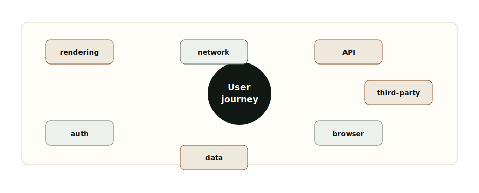
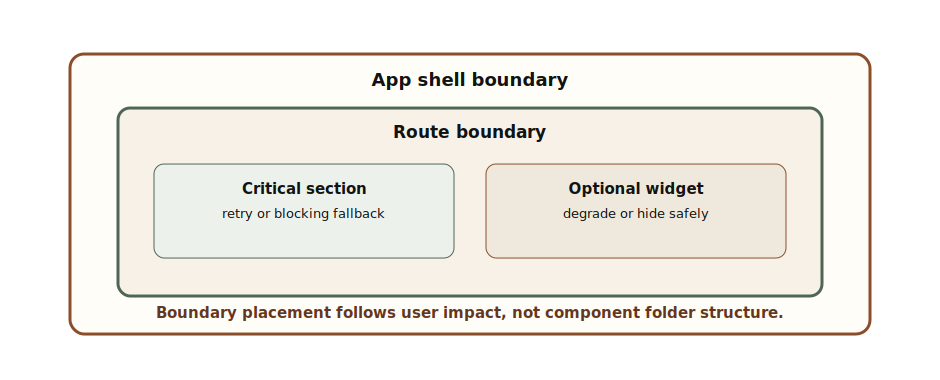
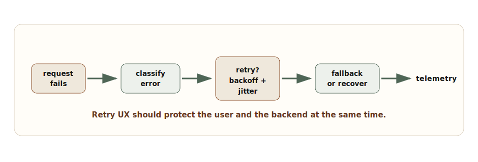
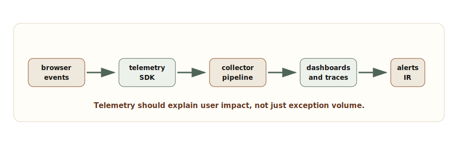

# Chapter 8: Failure Handling in Frontend Systems

**Chapter objective:** Design resilient failure architecture through failure taxonomy, error boundary placement, retry strategy, degraded UI, offline and auth expiry handling, and observability — so teams can contain failure, preserve user work, and respond like operators rather than detectives.

**Why this matters:** A feature is not production-ready because it renders with healthy APIs. It is production-ready when the team knows what happens under partial failure — and has classified, contained, and measured every failure class.

---

Production frontend engineering is not about the happy path. The real test is what the user experiences when APIs fail, auth expires, networks fluctuate, browser features differ, third-party scripts break, and the UI has only partial truth.

Failure handling is not a toast component. It is an architecture discipline: classifying failure, isolating blast radius, preserving useful work, guiding recovery, measuring impact, and giving teams enough telemetry to respond like operators rather than detectives.

> *Resilient frontend systems do not hide failure. They contain it, explain it, recover when possible, and measure the user impact when recovery is not possible.*

## Why This Matters for Senior Frontend Roles

Senior frontend engineers are expected to design beyond ideal conditions. The senior questions are:

- Which failures should block the page, and which should degrade a section?
- Where should error boundaries sit?
- Which errors are retryable, and which require user action?
- What happens when auth expires during a mutation?
- What state should survive offline mode?
- How do we avoid retry storms?
- What telemetry tells us the user journey is failing?
- Who responds when a frontend-only incident occurs?

Frontend failure handling is product work, platform work, and operational work at the same time.

## Problem Framing and Constraints

Failures are different. Treating them all as generic errors creates bad UX and bad operations.

**Rendering failures** come from component bugs, data shape assumptions, hydration mismatches, browser incompatibilities, and unhandled runtime exceptions.

**Network failures** come from offline mode, timeouts, DNS, captive portals, flaky mobile networks, and corporate proxies.

**API failures** include 4xx, 5xx, malformed responses, rate limits, partial responses, and contract drift.

**Auth failures** include expired sessions, refresh failure, revoked permissions, step-up authentication, and cross-tab logout.

**Data failures** include stale cache, missing fields, invalid domain state, conflict, and out-of-order updates.

**Browser failures** include storage quota, unsupported APIs, blocked cookies, extension interference, and low-memory tab eviction.

**Third-party failures** include analytics, chat, payment widgets, A/B testing, maps, and embedded content.



_Frontend Failure Taxonomy — Different failure classes need different containment, user messaging, retry behavior, and telemetry._

## Architecture Model

A resilient frontend has five layers.

The **prevention layer** reduces failure probability: type-safe contracts, defensive rendering, schema validation, performance budgets, accessibility tests, and release discipline.

The **containment layer** limits blast radius: route boundaries, section boundaries, widget fallbacks, Suspense boundaries, feature flags, and safe defaults.

The **recovery layer** decides what can retry, refresh, replay, reset, or ask for user action.

The **communication layer** tells users what is happening without creating panic or noise. A failed notification badge is different from a failed payment submission.

The **observability layer** records what failed, where, for whom, in which release, and with which dependency.

## Error Boundary Placement

Error boundaries should match product boundaries. A whole-app boundary is necessary but insufficient. A route boundary protects navigation. A section boundary protects partial rendering. A widget boundary protects optional integrations.



_Error Boundary Placement Map — Boundaries should be placed around app shell, routes, critical sections, and optional widgets so one failure does not erase the whole experience._

```tsx
"use client";

import React from "react";

type ErrorBoundaryProps = {
  name: string;
  fallback: React.ReactNode;
  children: React.ReactNode;
  onError?: (error: Error, info: React.ErrorInfo) => void;
};

type ErrorBoundaryState = {
  hasError: boolean;
};

export class ErrorBoundary extends React.Component<
  ErrorBoundaryProps,
  ErrorBoundaryState
> {
  state: ErrorBoundaryState = { hasError: false };

  static getDerivedStateFromError(): ErrorBoundaryState {
    return { hasError: true };
  }

  componentDidCatch(error: Error, info: React.ErrorInfo) {
    this.props.onError?.(error, info);
  }

  render() {
    if (this.state.hasError) {
      return this.props.fallback;
    }

    return this.props.children;
  }
}
```

The architecture decision is where boundaries sit and what fallback they show — not the component itself.

## API Error Classification

An API client should classify errors before UI components see them. Components should not parse every status code independently.

```ts
export type ApiErrorKind =
  | "network"
  | "timeout"
  | "unauthorized"
  | "forbidden"
  | "not-found"
  | "rate-limited"
  | "validation"
  | "server"
  | "unknown";

export type ClassifiedApiError = {
  kind: ApiErrorKind;
  retryable: boolean;
  userActionRequired: boolean;
  status?: number;
  correlationId?: string;
  message: string;
};

export function classifyApiError(error: unknown): ClassifiedApiError {
  if (error instanceof DOMException && error.name === "AbortError") {
    return {
      kind: "timeout",
      retryable: true,
      userActionRequired: false,
      message: "The request timed out."
    };
  }

  const status = readStatus(error);

  if (status === 401) {
    return { kind: "unauthorized", retryable: false, userActionRequired: true, status, message: "Sign in again." };
  }

  if (status === 403) {
    return { kind: "forbidden", retryable: false, userActionRequired: true, status, message: "You do not have access." };
  }

  if (status === 429) {
    return { kind: "rate-limited", retryable: true, userActionRequired: false, status, message: "Too many requests." };
  }

  if (status && status >= 500) {
    return { kind: "server", retryable: true, userActionRequired: false, status, message: "The service is unavailable." };
  }

  return { kind: "unknown", retryable: false, userActionRequired: true, status, message: "Something went wrong." };
}
```

Once errors are classified, the UI can choose retry, re-auth, permission messaging, degraded mode, or support escalation.

## Retry and Fallback UX

Retries should be intentional. Retrying every failure immediately creates duplicate actions, user confusion, and backend load. Retrying nothing makes transient failures feel permanent.



_Retry and Fallback Sequence — A resilient sequence classifies the error, chooses retry or fallback, preserves useful state, and records telemetry._

```ts
type RetryPolicy = {
  maxAttempts: number;
  baseDelayMs: number;
  maxDelayMs: number;
  retryableKinds: ApiErrorKind[];
};

export async function runWithRetry<T>(
  operation: () => Promise<T>,
  classify: (error: unknown) => ClassifiedApiError,
  policy: RetryPolicy
): Promise<T> {
  let attempt = 0;

  while (true) {
    try {
      return await operation();
    } catch (error) {
      attempt += 1;
      const classified = classify(error);
      const canRetry =
        attempt < policy.maxAttempts &&
        policy.retryableKinds.includes(classified.kind);

      if (!canRetry) {
        throw classified;
      }

      const delay = Math.min(
        policy.maxDelayMs,
        policy.baseDelayMs * 2 ** (attempt - 1)
      );

      await wait(delay * (0.7 + Math.random() * 0.3));
    }
  }
}
```

Backoff with jitter avoids synchronized retry storms. User-facing retry should also explain whether work was saved, queued, discarded, or needs review.

## Degraded and Offline States

Graceful degradation means the user can still do something useful or at least understand what is unavailable. A dashboard can show cached data with a freshness label. A form can preserve a draft offline. A third-party widget can be replaced by a link. A failed secondary panel should not erase the primary workflow.

Offline handling is product-specific. Some flows can queue actions. Some must block. Some can save drafts locally. Some cannot store anything because of security constraints. Senior design names these differences explicitly.

Auth expiry is a special failure. The user should not lose work because a session expired. Preserve draft state when safe. Re-authenticate, then replay or resume the action only when the operation is idempotent and secure.

## Observability Pipeline

Without observability, frontend incidents become anecdotal. "Some users saw blank screens" is not enough. You need route, release, user journey, dependency, error class, browser, device, network, and correlation ID.



_Frontend Observability Pipeline — Browser events should flow through a telemetry SDK into collection, dashboards, alerts, and incident response._

```ts
export type FrontendTelemetryEvent = {
  type:
    | "render_error"
    | "api_error"
    | "auth_expired"
    | "retry_exhausted"
    | "degraded_mode_entered"
    | "offline_detected";
  route: string;
  release: string;
  journey: string;
  severity: "info" | "warning" | "critical";
  dependency?: string;
  errorKind?: ApiErrorKind;
  correlationId?: string;
  userImpact: "none" | "partial" | "blocked";
  metadata?: Record<string, string | number | boolean>;
};
```

Good telemetry lets teams answer: how many users were blocked, which route failed, what dependency was involved, whether retry helped, and which release introduced the issue.

## Trade-offs

| Decision | Option A | Option B | Senior trade-off |
| --- | --- | --- | --- |
| Boundary placement | Coarse app boundary | Route and section boundaries | Coarse boundaries are easy but erase too much UI. Section boundaries preserve useful work but require better fallback design. |
| Retry | Automatic retry | User-triggered retry | Automatic retry handles transient failures but can overload services. User retry gives control but can feel manual. |
| Degradation | Hide failed sections | Show stale or partial data | Hiding reduces confusion for optional widgets. Stale data can help decisions only when freshness is clearly labeled. |
| Offline | Queue actions | Block actions | Queuing improves continuity but needs idempotency and conflict handling. Blocking is safer for sensitive workflows. |
| Observability | Error counts | Journey impact metrics | Counts are easy. Impact metrics guide incident response and prioritization. |

## Failure Modes

Failure-handling systems also fail:

- Error boundaries are only at the app root, so one widget blanks the whole page.
- API errors are displayed as generic messages with no recovery path.
- Retry loops create duplicate mutations.
- Offline mode stores sensitive data in unsafe storage.
- Auth expiry discards an in-progress form.
- Stale cached data is shown without a timestamp.
- Telemetry captures stack traces but no route, release, or user impact.
- Frontend incidents are routed to backend teams because ownership is unclear.

Recovery design means deciding before production how each failure class behaves: block, degrade, retry, refresh, re-authenticate, queue, discard, or escalate.

> **Frontend incident test**
>
> Turn off one API, expire auth mid-submit, block a third-party script, force offline mode, and throw inside a secondary widget. If users cannot recover or teams cannot diagnose impact, the failure architecture is incomplete.

## Interview Lens

Start with taxonomy:

> I would first classify failures: rendering, network, API, auth, data, browser, and third-party. Then I would decide containment, recovery, user messaging, and telemetry for each class.

Then explain:

1. Place error boundaries by product impact, not component folder structure.
2. Classify API errors centrally so components do not parse status codes.
3. Retry only retryable failures with backoff and jitter.
4. Preserve user work when safe.
5. Use degraded UI for partial failures, with labeled freshness for stale data.
6. Handle auth expiry and offline mode explicitly.
7. Emit telemetry tied to route, release, dependency, and user journey.
8. Define frontend incident ownership and escalation path.

That answer shows operational maturity, not just React knowledge.

## Key Takeaways

- Failure taxonomy is the foundation — rendering, network, API, auth, data, browser, and third-party failures each need different handling.
- Error boundaries should match product impact, not component hierarchy.
- API errors should be classified centrally before components see them.
- Retry requires backoff, jitter, max attempts, and idempotency awareness.
- Degraded states should be labeled; stale data without freshness indication creates false confidence.
- Auth expiry should preserve safe user work before re-authenticating.
- Telemetry must include route, release, dependency, journey, severity, and user impact — not just stack traces.
- Frontend incident ownership must be declared before an incident occurs.

## Production Checklist

- [ ] Failure taxonomy is documented for critical flows.
- [ ] Error boundaries exist at app, route, section, and optional widget levels where appropriate.
- [ ] API errors are classified centrally with `retryable` and `userActionRequired` flags.
- [ ] Retry policy includes max attempts, backoff, jitter, and idempotency rules.
- [ ] Auth expiry preserves safe user work and resumes only secure, idempotent actions.
- [ ] Offline behavior is explicit: block, draft, queue, or degrade.
- [ ] Partial rendering states are designed and tested.
- [ ] Stale data is labeled with freshness information.
- [ ] Telemetry includes route, release, dependency, journey, severity, correlation ID, and user impact.
- [ ] Frontend incident ownership and escalation path are documented.

---

[← Chapter 7: Designing Frontend Platforms](07-frontend-platforms.md) | [Table of Contents](../README.md) | [Chapter 9: Frontend Security Architecture →](09-security-architecture.md)

*Source: [Failure Handling in Frontend Systems: Resilience, Graceful Degradation, Retry UX, and Observability](https://blog.ranveerkumar.com/articles/failure-handling-in-frontend-systems-resilience-graceful-degradation-retry-ux-observability)*
