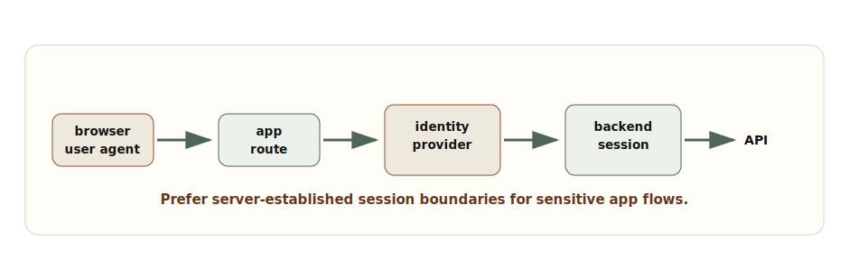
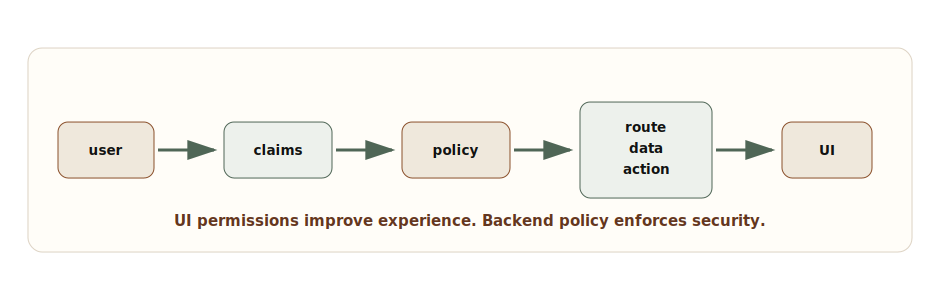
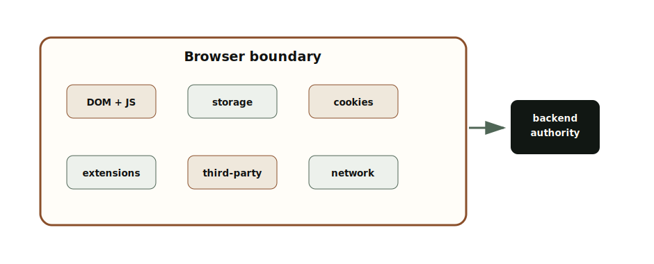
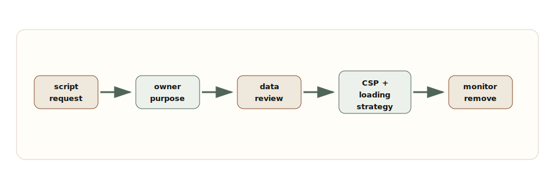

# Chapter 9: Frontend Security Architecture

**Chapter objective:** Design frontend security through proper auth flow architecture, token storage boundaries, permission models, route guards, CSP, browser risk reduction, third-party script governance, and secure defaults — understanding that the frontend guides secure behavior but cannot become the source of authorization truth.

**Why this matters:** Frontend security fails at boundaries. A hidden button mistaken for authorization. A token in local storage exposed by XSS. A `NEXT_PUBLIC_` variable containing a private key. A client route guard that looks secure until the API accepts direct calls. These failures are architecture failures, not implementation accidents.

---

Frontend security is not solved by hiding buttons. A secure frontend design understands browser boundaries, token exposure, permission models, content security policy, third-party scripts, and what must never be trusted on the client.

The browser is an untrusted execution environment. Users can inspect code, modify requests, call APIs directly, replay actions, change local storage, and run extensions. Frontend security must be designed around the right boundaries: what the UI can safely represent, what the backend must enforce, which data should never be exposed, and how the browser should be constrained.

> *The frontend can guide secure behavior, reduce exposure, and constrain the browser. It cannot become the source of authorization truth.*

## Why This Matters for Senior Frontend Roles

Senior frontend engineers are closest to the place where security mistakes become visible: login flows, user roles, route protection, forms, file uploads, rich content, analytics, third-party scripts, environment variables, and data shown in the browser.

The senior questions are:

- Where does authentication happen, and where is the session established?
- Are tokens exposed to JavaScript, and if so, why?
- Which checks are UX-only, and which are enforced by the backend?
- Can a user call the data API directly and bypass the UI?
- Does the frontend ever receive fields the user should not see?
- What XSS protections exist beyond "React escapes strings"?
- What third-party scripts can execute on the page?
- What secrets are accidentally bundled into client code?
- What defaults prevent insecure releases?

## Problem Framing and Constraints

Separate identity, session, permissions, and presentation.

**Identity** answers who the user is. **Authentication** proves it. **Session management** keeps that proof usable across requests. **Authorization** decides what the user can read or do. **Presentation** decides what the UI shows.

When these are mixed together, security bugs appear. A hidden button becomes mistaken for authorization. A JWT in local storage becomes convenient until an XSS bug exposes it. A client route guard looks secure until the API accepts direct calls. A `NEXT_PUBLIC_` variable leaks a private key because someone thought env vars were automatically server-only.



_Authentication and Session Flow — A secure frontend auth flow separates browser navigation, identity provider authentication, backend session creation, and API authorization._

## Architecture Model

Use four boundaries.

The **authentication boundary** proves identity. For web apps, a common secure pattern is an identity provider flow that returns to the app, then a backend exchanges the code and establishes a session using a secure, HTTP-only, same-site cookie. This reduces token exposure to JavaScript.

The **authorization boundary** decides what data and actions are allowed. This must live server-side. The frontend can render permissions, but the backend enforces them.

The **browser boundary** reduces what hostile scripts, browser APIs, extensions, storage, and third-party code can access. CSP, secure cookies, careful storage choices, and data minimization matter here.

The **release boundary** prevents insecure configuration from shipping: environment variable rules, dependency review, third-party script review, CSP reporting, and secure defaults in templates.

## Session Cookies Versus Tokens

Tokens are not bad. Exposed tokens are risky. A bearer token available to JavaScript is valuable to an attacker if XSS occurs. Local storage increases persistence. Session storage reduces persistence but still exposes the token to JavaScript. Memory-only tokens reduce persistence but complicate refresh and multi-tab behavior.

HTTP-only secure cookies reduce JavaScript exposure, but they require CSRF considerations and careful same-site settings. The right answer depends on architecture, domain, API shape, identity provider, and threat model.

For many server-rendered or BFF-style web applications, a server-managed session cookie is the safer default. For public APIs and native clients, token flows may be appropriate. The senior move is to explain the exposure model, not to argue for one storage mechanism universally.

## Permission Model

Permissions should be explicit and action-oriented. Roles are useful grouping mechanisms, but UI decisions should usually evaluate permissions.

```ts
export type Role = "viewer" | "operator" | "admin";
export type Resource = "invoice" | "user" | "report" | "settings";
export type Action = "read" | "create" | "update" | "delete" | "approve" | "export";

export type Claims = {
  userId: string;
  tenantId: string;
  roles: Role[];
  permissions: Array<`${Resource}:${Action}`>;
};

export function can(
  claims: Claims,
  resource: Resource,
  action: Action
) {
  return claims.permissions.includes(`${resource}:${action}`);
}

export function requirePermission(
  claims: Claims,
  resource: Resource,
  action: Action
) {
  if (!can(claims, resource, action)) {
    throw new Error(`Missing permission: ${resource}:${action}`);
  }
}
```

This model is useful for rendering and for server-side checks. The important rule: the client can use `can` to hide or disable UI, but server handlers must still enforce the permission.



_RBAC Rendering Pipeline — User claims should be evaluated against policy to produce route, data, and action permissions before the UI renders affordances._

## Route Guard Pattern

Route guards are useful UX boundaries, but they are not security boundaries by themselves.

```tsx
type ProtectedRouteProps = {
  claims: Claims | null;
  resource: Resource;
  action: Action;
  children: React.ReactNode;
};

export function ProtectedRoute({
  claims,
  resource,
  action,
  children
}: ProtectedRouteProps) {
  if (!claims) {
    return <LoginRequired />;
  }

  if (!can(claims, resource, action)) {
    return <PermissionDenied resource={resource} action={action} />;
  }

  return <>{children}</>;
}
```

Use this to avoid confusing users. Do not use it as the only protection. Data loaders, server actions, API routes, and backend services must check the same policy.

## Browser Security Boundary



_Browser Security Boundary Map — The browser contains untrusted code execution, storage, network access, third-party scripts, extensions, and user-controlled inputs._

The browser boundary is where XSS, token exposure, sensitive data leakage, and third-party script risk become real. Minimize what enters the browser. Avoid storing secrets. Treat local storage as user-controlled. Treat client logs and analytics payloads as potential exposure points.

## CSP and Third-Party Script Governance

CSP reduces XSS blast radius and helps govern what can execute. It is not a substitute for sanitization, escaping, dependency review, or safe rendering, but it is a strong layer.

```ts
export const cspStarterPolicy = [
  "default-src 'self'",
  "script-src 'self' 'nonce-{NONCE}'",
  "style-src 'self' 'unsafe-inline'",
  "img-src 'self' data: https:",
  "font-src 'self'",
  "connect-src 'self' https://api.example.com",
  "frame-ancestors 'none'",
  "base-uri 'self'",
  "form-action 'self'",
  "object-src 'none'",
  "upgrade-insecure-requests"
].join("; ");
```

This is a starter, not a universal policy. Real policies need environment-specific domains, nonce handling, report-only rollout, and third-party review. Avoid adding broad sources like `*` or unnecessary unsafe script allowances.



_CSP and Third-Party Script Governance — Third-party scripts should pass ownership, purpose, consent, loading, CSP, and monitoring checks before they execute._

## Secure Environment Variables

Frontend builds turn some configuration into public code. Treat anything prefixed for the client as public.

```ts
export const secureEnvironmentChecklist = [
  "Secrets are never prefixed with NEXT_PUBLIC_ or bundled into client code",
  "Client-visible environment variables are treated as public configuration",
  "Server-only API keys are read only in server routes, actions, or backend services",
  "Build logs do not print secrets",
  "Preview environments use scoped credentials",
  "Analytics and telemetry payloads exclude tokens, cookies, PII, and sensitive business data",
  "CSP and allowed origins are environment-specific and reviewed",
  "Secret rotation path is documented"
] as const;
```

## Trade-offs

| Decision | Option A | Option B | Senior trade-off |
| --- | --- | --- | --- |
| Session storage | HTTP-only secure cookie | JavaScript-readable token | Cookies reduce token exposure to XSS but require CSRF design. JS-readable tokens simplify API calls but increase exposure if XSS occurs. |
| Permission UI | Hide unavailable actions | Show disabled with reason | Hiding reduces clutter. Disabled states improve clarity and explain access gaps. Neither replaces backend enforcement. |
| CSP rollout | Report-only first | Enforce immediately | Report-only reduces breakage during tuning. Enforcement gives protection but can break uncontrolled third-party code. |
| Route guards | Client guard | Server guard plus API policy | Client guards improve UX. Server/API checks enforce actual security. |
| Third-party scripts | Feature-owned | Governed registry | Feature ownership moves fast. Registry controls data exposure, performance, consent, and CSP. |

## Failure Modes

Frontend security failures are often boundary failures:

- A hidden admin button is treated as authorization.
- API returns sensitive fields and trusts the UI not to display them.
- A token in local storage is exposed after an XSS bug.
- A `NEXT_PUBLIC_` variable contains a private key.
- CSP allows broad script sources because one integration needed an exception.
- Auth expires during a sensitive operation and the UI retries unsafely.
- Third-party scripts collect data that was never reviewed.
- Error logs include tokens, request bodies, or PII.

Recovery requires layered response: revoke tokens or sessions, rotate secrets, disable risky scripts, tighten CSP, remove exposed fields from APIs, add server-side checks, and audit logs and telemetry payloads.

> **Security architecture test**
>
> Assume a user bypasses the UI and calls the API directly. If the action succeeds without backend authorization, the frontend was never the security boundary.

## Interview Lens

Start with boundaries:

> I would separate authentication, authorization, client presentation, and backend enforcement. The frontend can guide secure UX, but the backend must enforce route, data, and action permissions.

Then explain:

1. Use secure session architecture appropriate to the app: minimize token exposure to JavaScript.
2. Evaluate permissions from claims and policy, but enforce them server-side.
3. Avoid sending unauthorized data to the browser at the API level.
4. Use CSP, sanitization, and third-party governance to reduce XSS and script risk.
5. Treat client env vars as public — never bundle secrets.
6. Add secure defaults to release templates and CI.
7. Monitor security-relevant frontend events without leaking sensitive data.

That answer shows you understand the browser as a boundary, not a trusted runtime.

## Key Takeaways

- The browser is an untrusted execution environment — design around boundaries, not assumptions.
- Authentication proves identity; authorization enforces access. The backend is the authority for both.
- Route guards and permission UI are UX improvements, not security controls.
- Token storage risk is a real design decision: minimize JavaScript-accessible token exposure.
- CSP is a strong layer but not a substitute for sanitization, escaping, or dependency review.
- Third-party scripts have data exposure, performance, and execution risks — govern them explicitly.
- Client environment variables are public configuration — never bundle secrets.
- Security telemetry should capture auth failures, permission denials, and CSP reports without leaking sensitive payloads.

## Production Checklist

- [ ] Authentication flow and session ownership are documented.
- [ ] Token storage risk is explicitly accepted and justified.
- [ ] Server enforces route, data, and action authorization independent of UI.
- [ ] UI permissions are treated as presentation, not enforcement.
- [ ] APIs do not return fields the user should not see.
- [ ] Sensitive data is not stored in local storage, logs, URLs, or analytics payloads.
- [ ] CSP exists, starts in report-only mode where needed, and avoids broad script allowances.
- [ ] Third-party scripts have owner, purpose, data review, CSP entry, loading strategy, and removal plan.
- [ ] Client-exposed environment variables contain only public configuration.
- [ ] CSRF, XSS, auth expiry, and secret rotation paths are reviewed.
- [ ] Security telemetry avoids secrets and includes route, release, and correlation context.

---

[← Chapter 8: Failure Handling in Frontend Systems](08-failure-handling.md) | [Table of Contents](../README.md) | [Chapter 10: Senior Frontend System Design Interviews →](10-system-design-interviews.md)

*Source: [Frontend Security Architecture: Auth, Tokens, RBAC, CSP, Browser Risks, and Secure Defaults](https://blog.ranveerkumar.com/articles/frontend-security-architecture-auth-tokens-rbac-csp-browser-risks-secure-defaults)*
