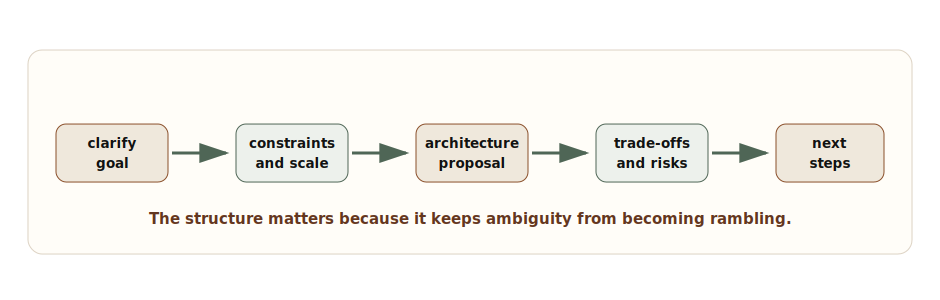
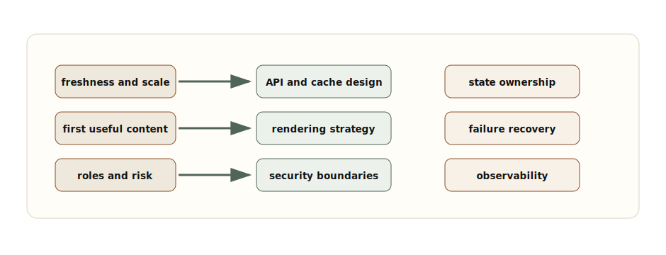
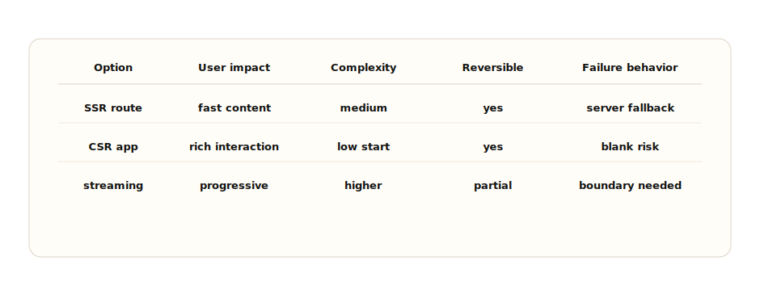
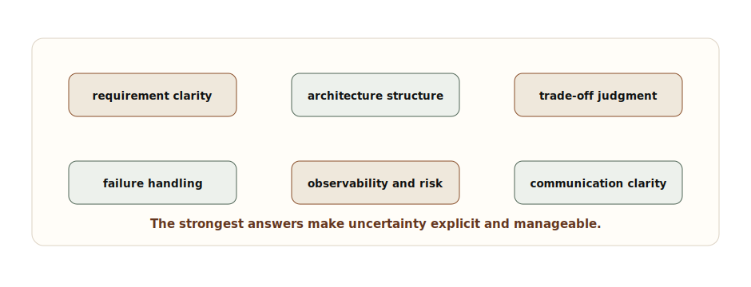

# Chapter 10: Senior Frontend System Design Interviews

**Chapter objective:** Turn the concepts from every previous chapter into an interview playbook — a thinking model, requirement clarification framework, architecture proposal structure, trade-off communication language, and self-evaluation rubric for senior frontend system design interviews.

**Why this matters:** Senior frontend system design interviews reward clarity under ambiguity. The strongest candidates do not rush to React code. They define constraints, expose trade-offs, design for failure, and communicate like future technical leaders.

---

Senior frontend system design interviews reward clarity under ambiguity. The strongest candidates do not rush to React code. They define constraints, expose trade-offs, design for failure, and communicate like future technical leaders.

Code is not unimportant. It means code is the last mile of a design conversation, not the first reflex. At senior levels, interviewers are listening for judgment: how you clarify requirements, frame scale, identify risks, choose rendering and state strategy, protect accessibility and performance, handle security boundaries, explain trade-offs, and adapt when new constraints appear.

> *The interview is not testing whether you know every framework API. It is testing whether you can turn ambiguity into a defensible frontend architecture.*

## Why This Matters for Senior Frontend Roles

Senior interviews simulate real leadership pressure. You rarely receive perfect requirements in production. You receive a goal, a deadline, incomplete constraints, and a set of people who need a clear path forward.

The prompt might be "design a real-time dashboard", "design a schema-driven form builder", "design a notification system", "design a product analytics UI", or "design a checkout flow." The trap is to immediately draw components. Components are necessary, but they are not the design.

Strong candidates show they can:

- Clarify the user journey and success criteria.
- Name scale assumptions and data freshness needs.
- Separate local, server, URL, global, form, and workflow state.
- Choose rendering strategy intentionally.
- Explain performance, accessibility, security, and observability.
- Discuss failure modes and recovery paths.
- Communicate trade-offs without sounding evasive.
- Adapt when the interviewer changes constraints.

The interview is a conversation. Treat it like a design review, not a trivia session.

## Problem Framing and Constraints

Start by asking for the product job. Ask questions that shape architecture, not disconnected trivia questions.

- Who is the primary user?
- What is the critical journey?
- What are the latency and freshness requirements?
- What is the expected data volume?
- Is the experience public, authenticated, or role-specific?
- What must work on slow devices or poor networks?
- What are the most important failure modes?
- What must be accessible from keyboard and assistive technology?
- What telemetry proves the experience works?

Then state assumptions if the interviewer does not provide details. Senior candidates do not wait silently for perfect inputs. They make reasonable assumptions, say them clearly, and invite correction.

_Senior Frontend System Design Answer Flow — A strong answer moves from clarification to constraints, architecture, trade-offs, failure handling, and next steps._

## Architecture Mental Model

Use a layered answer. It prevents getting trapped in component details too early.

Start with user journey and constraints. Then discuss data and state. Then routing and rendering. Then interaction model. Then failure handling. Then performance, accessibility, security, and observability. Then component structure.

This order tells the interviewer that you understand frontend as product infrastructure.

_Requirements-to-Architecture Map — Requirements should map to concrete architecture decisions across data, rendering, state, UX, security, and operations._

## The Six-Step Answer Template

Use a template, not a script. The goal is structure without sounding memorized.

### Step 1: Restate the problem

Open with a single framing sentence so both you and the interviewer are aligned on scope:

> "We need to design `<experience>` for `<primary users>` so they can complete `<critical journey>` reliably."

### Step 2: Clarify constraints

Ask only questions that change architecture. Cover:

- Users and roles
- Data volume and freshness requirements
- Performance targets (latency, load time, device tier)
- Accessibility and device requirements
- Security and permission boundaries

### Step 3: State assumptions

When the interviewer does not supply a detail, name your assumption and invite correction rather than waiting:

> "I will assume `<reasonable assumption>`. If that changes, I would adjust `<specific decision>`."

### Step 4: Propose architecture

Walk through each layer in order. Avoid jumping to components before resolving data and state:

- Route and rendering strategy
- Data contracts and cache shape
- State ownership (local, server, URL, global, workflow)
- Component boundaries
- Failure handling and degraded states
- Observability and telemetry

### Step 5: Explain trade-offs

Name at least two options for each significant decision, state why one fits the current constraints, and identify what would make you choose the other.

### Step 6: Close with risks and next steps

End with honesty about what is still uncertain:

- Open risks and unknowns
- What to prototype or spike first
- What to measure in production to confirm the architecture holds

The best candidates keep returning to constraints throughout. That is how you avoid sounding like you are reciting a favorite architecture.

## Trade-Off Communication

_Trade-Off Matrix for Implementation Options — A senior answer compares options by user impact, operational complexity, reversibility, performance, and failure behavior._

| Interview decision | Strong communication | Weak communication |
| --- | --- | --- |
| Rendering | "I would use SSR because first useful content is personalized and SEO matters; if personalization moved below the fold, ISR becomes attractive." | "I would use Next.js because it is fast." |
| State | "Filters belong in the URL, server data in a cache, form edits in draft state, and workflow transitions in a state machine." | "I would use a global store." |
| Real time | "We need event IDs, ordering rules, replay, degraded UI, and backoff." | "I would open a WebSocket." |
| Security | "The UI can hide actions, but backend policy must enforce route, data, and action permissions." | "We can hide the admin button." |
| Performance | "I would define LCP, INP, JS budget, and RUM ownership before choosing interaction boundaries." | "We can optimize later." |

## Self-Evaluation Rubric

Use these five dimensions to review your own answer after a practice session or a real interview.

| Dimension | Strong signal | Weak signal |
| --- | --- | --- |
| Requirement clarity | Clarifies users, journey, scale, freshness, performance, accessibility, security, and failure modes. | Asks generic questions or starts building without stating assumptions. |
| Architecture structure | Separates routing, rendering, data, state, components, failures, and observability as distinct concerns. | Describes a component tree without system boundaries. |
| Trade-offs | Explains why an option fits the current constraints and what would make another option the right choice. | Presents a favorite tool or pattern as a universal answer. |
| Failure handling | Designs retry behavior, degraded states, stale data policy, auth expiry recovery, and telemetry. | Adds a generic error toast and moves on. |
| Communication | States assumptions explicitly, invites correction, and closes with risks and next steps. | Rambles without structure or treats interviewer questions as interruptions. |

## Sample Problem Outline: Real-Time Dashboard

**Goal:** Design an operational dashboard for support teams monitoring live incidents.

**Clarification questions:**

- How fresh must incident status be — seconds, sub-second, or eventual?
- Do users need a full event stream or only the latest state per incident?
- How many concurrent users and open incidents must the system support?
- What should the UI do when the stream disconnects?
- Which actions (escalate, close, assign) require role-based permissions?

**Architecture decisions:**

- SSR or streaming shell for first useful content before the live stream connects
- WebSocket for bidirectional actions, SSE if read-only updates are sufficient
- Event envelope with `id`, `topic`, `sequence`, and replay token for reconnect
- Server-state cache for incident summaries; URL state for filters and selected queue
- Degraded mode showing a "last updated" timestamp when the stream is unavailable
- Telemetry capturing stream lag, reconnect frequency, dropped events, and failed actions

**Key trade-offs:**

- WebSocket versus SSE: WebSocket supports bidirectional actions; SSE is simpler for read-only feeds
- Latest-state wins versus ordered event replay: latest-state is simpler but loses intermediate transitions
- Optimistic action updates versus server confirmation: optimistic UX is faster but requires rollback on failure

## Sample Problem Outline: Schema-Driven Form Builder

**Goal:** Design a configurable form builder for enterprise onboarding workflows.

**Clarification questions:**

- Who authors schemas — engineers, product managers, or non-technical configurators?
- Which field types are in scope, and what governs the approved list?
- Which validation rules run client-side versus server-side?
- How do roles and workflow states affect field visibility or editability?
- How are schema versions published, rolled out, and rolled back safely?

**Architecture decisions:**

- Versioned schema model with a constrained set of approved field types
- Resolver that converts a schema and context (role, workflow state) into a render plan
- Field registry mapping type identifiers to approved React components
- Validation pipeline handling sync rules, async rules, conditional rules, and server-side rules
- Submit boundary that emits typed domain commands rather than raw form values
- Schema validation step in CI before any schema change reaches production
- Telemetry capturing schema ID, version, field ID, validation outcomes, and submit results

**Key trade-offs:**

- Configurability versus governance: wider field types enable more use cases but increase review surface
- Client visibility rules versus server authorization: hiding fields is UX; server-side checks are the enforcement boundary
- Generic renderer versus product-specific screens: a generic renderer scales across teams but limits screen-level UX control

## Handling Interviewer Pivots

When the interviewer changes a constraint, do not defend the old answer. Treat the pivot as useful input.

Examples:

- "If data volume grows 100x, I would move filtering and sorting fully server-side and introduce virtualization and cursor pagination."
- "If SEO no longer matters, I would consider client rendering for the interactive surface, but I would still protect first useful content."
- "If auth becomes multi-tenant, I would make tenant scope part of every route, query key, and backend policy check."
- "If offline is required, I would separate draftable actions from sensitive actions that must remain online."

That is trade-off communication in action.

## Failure Modes

Interview answers fail in predictable ways:

- Starting with components before clarifying the user journey.
- Naming tools without explaining constraints.
- Ignoring accessibility, security, observability, or failure modes.
- Treating backend contracts as fixed without discussing API shape.
- Over-indexing on happy path state.
- Refusing to make assumptions.
- Over-designing every edge case without prioritizing.
- Failing to summarize risks and next steps.

Recovery is simple: pause, restate the constraint, and adjust.

_Interview Evaluation Rubric — Interviewers evaluate clarity, constraints, architecture, trade-offs, failure handling, communication, and leadership judgment._

## Performance, Accessibility, Security, and Observability

For **performance**, name the budget and the strategy: LCP target, INP risk, hydration boundaries, bundle budget, image strategy, and RUM.

For **accessibility**, name keyboard behavior, focus management, semantics, validation messaging, live regions, reduced motion, and testing.

For **security**, name auth/session boundaries, server-side authorization, data exposure, token storage, CSRF/XSS, CSP, and third-party scripts.

For **observability**, name route, release, dependency, user journey, correlation ID, frontend errors, web vitals, failed actions, and degraded-mode metrics.

These topics do not need to dominate every interview. They need to appear when relevant, because they prove you are designing for production.

## Key Takeaways

- Start with the user journey and constraints, not components.
- State assumptions explicitly and invite correction — do not wait for perfect requirements.
- Walk architecture layers in order: data and state before rendering, rendering before components.
- Name at least two trade-off options for each significant decision.
- Design for failure, not just the happy path.
- Keep returning to constraints when evaluating every choice.
- Close with risks, what to validate, and what to measure in production.
- Treat interviewer pivots as useful input, not challenges to defend against.

## Production Checklist

- [ ] Restated the problem and primary user journey.
- [ ] Clarified scale, freshness, latency, device, accessibility, security, and observability constraints.
- [ ] Stated assumptions clearly and invited correction.
- [ ] Proposed route, rendering, data, state, component, and platform boundaries.
- [ ] Explained at least two meaningful trade-offs with reasoning.
- [ ] Included failure modes and recovery behavior.
- [ ] Addressed performance, accessibility, security, and observability where relevant.
- [ ] Responded to interviewer pivots by adjusting architecture, not resisting.
- [ ] Closed with risks, validation plan, and next steps.

---

[← Chapter 9: Frontend Security Architecture](09-security-architecture.md) | [Table of Contents](../README.md) | [Closing Note →](11-closing-note.md)

*Source: [Senior Frontend System Design Interviews: How to Think, Communicate, and Trade Off](https://blog.ranveerkumar.com/articles/senior-frontend-system-design-interviews-how-to-think-communicate-trade-off)*
